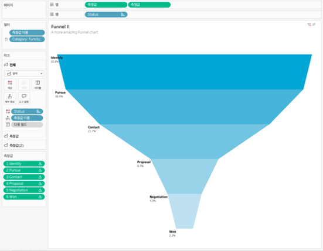

## 학습 목표

- 퍼널 차트의 개념과 활용 목적을 이해합니다.
- 단계별 이탈과 전환 흐름을 해석할 수 있습니다.
- 퍼널 차트가 적합한 데이터 구조를 설명할 수 있습니다.
- Tableau에서 퍼널 차트를 만드는 방법을 이해합니다.

## 목차

1. 퍼널 차트란?
2. 퍼널 차트를 자주 쓰는 이유
3. Tableau에서 퍼널 차트 만드는 방법

## 1. 퍼널 차트란?

퍼널 차트는 단계별로 점차 감소하는 값을 시각적으로 표현하여, 프로세스 진행 과정에서의 전환율과 이탈 구간을 보여주는 차트입니다.

- 단계별 잔존 수량
- 이탈 규모
- 전환 흐름

을 한눈에 볼 수 있어 전환 분석에 적합합니다.

즉, 퍼널 차트는 단순 크기 비교보다 `단계가 진행되면서 얼마나 줄어드는가`를 보는 데 강합니다.

## 2. 퍼널 차트를 자주 쓰는 이유

퍼널 차트는 각 단계 간 감소 폭을 통해 병목 구간이나 성과 저하 지점을 직관적으로 파악할 수 있습니다.

대표적인 예시는 다음과 같습니다.

- 마케팅 전환 단계 분석
- 구매 프로세스 이탈률 확인
- 채용 단계별 후보자 감소 흐름 표현

퍼널 차트는 각 단계의 절대값보다 "어느 단계에서 가장 많이 빠지는가"를 찾는 데 강합니다.

## 3. Tableau에서 퍼널 차트 만드는 방법

이미지처럼 퍼널 차트는 단계 차원을 축에 두고, 양쪽으로 퍼지는 영역을 이중 축으로 겹쳐서 만듭니다.

구성 순서는 다음과 같습니다.

1. 단계 차원(`Status` 등)을 `행`에 배치합니다.
2. 단계별 건수 또는 전환 수치를 `열`에 두 번 올립니다.
3. 한 축은 양수, 다른 축은 음수 계산 필드로 만들어 좌우 대칭 구조를 만듭니다.
4. 두 마크 유형을 `영역(Area)`으로 변경합니다.
5. 두 축을 `이중 축(Dual Axis)`으로 맞춥니다.
6. 축 머리글을 숨기고 색상과 레이블을 정리합니다.
7. 필요하면 단계별 전환율 계산 필드를 라벨로 추가합니다.

예시 화면에서는 다음이 핵심입니다.

- `행`: Status
- `열`: 측정값, 측정값
- `마크`: 영역
- `이중 축`: 좌우 대칭 퍼널 구성

퍼널 차트는 모양만 만드는 것보다 `단계 순서`를 비즈니스 흐름대로 유지하는 것이 더 중요합니다.  
정렬을 단순 내림차순으로 바꾸면 전환 구조 해석이 틀어질 수 있으므로, 단계 차원의 사용자 지정 정렬을 먼저 잡고 시작하는 편이 좋습니다.
