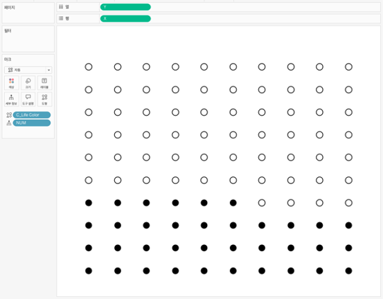

## 학습 목표

- 와플 차트의 개념과 활용 목적을 이해합니다.
- 전체 대비 비율을 격자 기반 시각화로 해석할 수 있습니다.
- Tableau에서 계산된 필드를 활용해 와플 차트를 구현하는 흐름을 이해합니다.

## 목차

1. 와플 차트란?
2. 와플 차트를 자주 쓰는 이유
3. Tableau에서 와플 차트 만드는 방법

## 1. 와플 차트란?

와플 차트는 전체 대비 비율을 일정 개수의 사각형 격자로 나누어, 채움 정도로 표현하는 차트입니다.

- 구성 비율과 점유율을 직관적으로 전달하는 데 적합합니다.
- 비율의 크기를 셀 개수로 나누어 보여주기 때문에 숫자를 시각적으로 쉽게 인식할 수 있습니다.
- 100칸 기준으로 만들면 퍼센트와 거의 1:1로 대응되어 이해가 빠릅니다.

즉, 와플 차트는 `전체 중 얼마를 차지하는가`를 한눈에 보여주는 데 강한 차트입니다.

## 2. 와플 차트를 자주 쓰는 이유

와플 차트의 가장 큰 장점은 단순 비율 비교를 명확하게 보여준다는 점입니다.

특히 다음과 같은 상황에서 유용합니다.

- 시장 점유율 표현
- 설문 응답 비율 비교
- 목표 달성률 시각화
- 찬성/반대, 완료/미완료 같은 상태 비율 표현

실무에서는 막대 차트나 파이 차트로도 비율을 표현할 수 있지만, 와플 차트는 `전체 100칸 중 몇 칸이 채워졌는가`라는 감각으로 비율을 바로 이해하게 도와줍니다.

다만 범주가 너무 많아지면 읽기 어려워질 수 있습니다.  
그래서 보통은 `하나의 비율`, 또는 `소수의 핵심 범주`를 보여줄 때 더 적합합니다.

## 3. Tableau에서 와플 차트 만드는 방법

이미지처럼 와플 차트는 `X`, `Y` 좌표로 10x10 격자를 만든 뒤, 채움 여부 계산 필드를 색상에 넣어 만듭니다.

구성 순서는 다음과 같습니다.

1. 1부터 100까지 셀 번호를 만들 수 있는 데이터 구조를 준비합니다.
2. 계산된 필드로 `X`, `Y` 좌표를 생성합니다.
3. 비율 값에 따라 몇 개 셀까지 채울지 계산합니다.
4. 채워질 셀은 `True`, 나머지는 `False`가 되도록 색상용 계산 필드를 만듭니다.
5. `열`에 `Y`, `행`에 `X`를 배치합니다.
6. 마크 유형을 `원` 또는 `사각형`으로 두고, 색상에 채움 계산 필드를 넣습니다.
7. 축, 격자선, 머리글을 숨겨 100칸 매트릭스처럼 보이게 정리합니다.

예시 화면 기준 구성은 다음과 같습니다.

- `열`: Y
- `행`: X
- `마크`: 원
- `색상`: 채움 여부 계산 필드

와플 차트는 차트 자체보다 `정렬 규칙`이 중요합니다.  
위에서 아래, 왼쪽에서 오른쪽처럼 채움 방향을 고정하지 않으면 같은 비율이라도 사용자가 다르게 읽을 수 있습니다.
