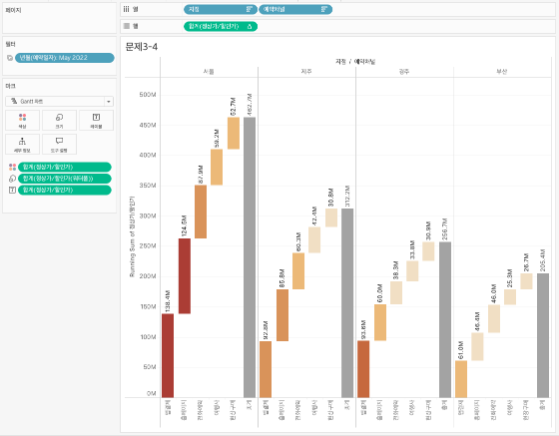

## 학습 목표

- 파레토 차트의 개념과 활용 목적을 이해합니다.
- 누적 기여도를 기준으로 핵심 원인을 식별하는 방법을 설명할 수 있습니다.
- Tableau에서 이중축과 퀵 테이블 계산으로 파레토 차트를 구현할 수 있습니다.

## 목차

1. 파레토 차트란?
2. 파레토 차트를 자주 쓰는 이유
3. Tableau에서 파레토 차트 만드는 방법

## 1. 파레토 차트란?

파레토 차트는 측정값을 내림차순 막대 차트로 표현하고, 같은 측정값의 누적 비율을 선(Line)으로 함께 표시하여 전체 결과에 큰 영향을 주는 핵심 요인을 식별하는 차트입니다.

즉, `어떤 항목이 결과 대부분을 만들어 내는가`를 보기 위한 차트라고 이해하면 됩니다.

핵심 구성은 다음과 같습니다.

- 막대: 항목별 절대값
- 선: 누적 비율
- 정렬: 큰 값에서 작은 값 순

이 구조 덕분에 개별 항목의 크기와 누적 기여도를 동시에 볼 수 있습니다.

## 2. 파레토 차트를 자주 쓰는 이유

파레토 차트는 소수의 주요 원인이 대부분의 결과를 만든다는 `파레토 법칙(80/20 법칙)`을 기반으로 우선순위를 분석할 때 자주 사용합니다.

대표적인 활용 예시는 다음과 같습니다.

- 불량 원인 상위 항목 분석
- 고객 불만 유형 우선순위 파악
- 매출 기여 상위 제품 식별

실무에서 중요한 이유는 단순히 많이 발생한 항목을 나열하는 데서 끝나지 않기 때문입니다.

- 어떤 항목부터 개선해야 효과가 큰지
- 상위 몇 개 항목이 전체의 몇 %를 차지하는지
- 자원을 어디에 우선 배분해야 하는지

를 함께 판단할 수 있습니다.

즉, 파레토 차트는 `순위 차트 + 누적 기여 차트`를 결합한 형태라고 볼 수 있습니다.

## 3. Tableau에서 파레토 차트 만드는 방법

이미지처럼 파레토 차트는 막대 차트와 누적 비율 선을 `이중 축`으로 겹쳐 만듭니다.

구성 순서는 다음과 같습니다.

1. 범주 차원(예: `Sub-Category`)을 `열`에 배치합니다.
2. 측정값(예: `매출`)을 `행`에 두 번 올립니다.
3. 첫 번째 마크는 `막대(Bar)`로 둡니다.
4. 두 번째 마크는 `선(Line)`으로 바꿉니다.
5. 두 번째 측정값에 `퀵 테이블 계산 → 누계(Running Total)`를 적용합니다.
6. 이어서 `구성 비율(Percent of Total)`을 적용해 누적 비율 선으로 바꿉니다.
7. 두 축을 `이중 축(Dual Axis)`으로 맞추고, 오른쪽 축을 백분율 형식으로 설정합니다.
8. 범주를 측정값 기준 `내림차순 정렬`합니다.

예시 화면 기준 구성은 다음과 같습니다.

- `열`: Sub-Category
- `행`: 매출, 매출
- 첫 번째 마크: 막대
- 두 번째 마크: 선

파레토 차트는 정렬이 핵심입니다.  
내림차순이 깨지면 누적 비율 선이 의미를 잃기 때문에, 실무에서는 정렬을 먼저 확정한 뒤 이중 축과 퀵 테이블 계산을 적용하는 편이 안정적입니다.
