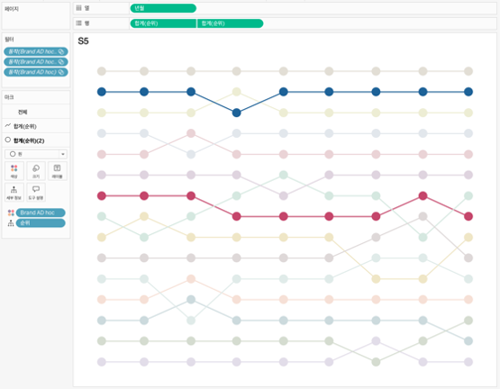

## 학습 목표

- 범프 차트의 개념과 활용 목적을 이해합니다.
- 시간 흐름에 따른 순위 변화를 해석할 수 있습니다.
- Tableau에서 순위 계산과 선 마크를 활용해 범프 차트를 구현할 수 있습니다.

## 목차

1. 범프 차트란?
2. 범프 차트를 자주 쓰는 이유
3. Tableau에서 범프 차트 만드는 방법

## 1. 범프 차트란?

범프 차트는 시간의 흐름에 따라 항목의 순위 변화를 선의 위치 이동으로 표현하는 차트입니다.

- 절대값 자체보다 순위 변동을 강조합니다.
- 경쟁 구도와 순위 변화 흐름을 보여 주는 데 적합합니다.
- 특정 항목이 언제 순위가 오르거나 내려갔는지 직관적으로 읽을 수 있습니다.

즉, 범프 차트는 “값이 얼마나 큰가”보다 “순위가 어떻게 바뀌는가”를 보여주는 차트입니다.

## 2. 범프 차트를 자주 쓰는 이유

범프 차트는 여러 항목이 시간 흐름 속에서 서로 순위를 다투는 상황을 볼 때 강합니다.

대표적인 활용 예시는 다음과 같습니다.

- 기간별 브랜드 순위 변화
- 매출 상위 제품 순위 추이
- 콘텐츠 인기 순위 변동 분석

실무에서는 절대값 차트만 보면 다음을 놓치기 쉽습니다.

- 누가 새롭게 상위권에 진입했는가
- 누가 지속적으로 순위를 유지했는가
- 특정 시점에 순위가 급격히 바뀐 항목은 무엇인가

즉, 범프 차트는 `순위 경쟁의 스토리`를 읽는 데 적합합니다.

## 3. Tableau에서 범프 차트 만드는 방법

이미지처럼 범프 차트는 `날짜`를 축에 두고, `순위 계산식`을 반대 축에 배치한 뒤, 항목별 선을 연결하는 방식으로 만듭니다.

구성 순서는 다음과 같습니다.

1. 날짜 필드를 `열`에 배치합니다.
2. 측정값을 기준으로 한 `순위 계산식`을 `행`에 올립니다.
3. 비교할 항목 차원을 `색상(Color)`과 `세부 정보(Detail)`에 넣습니다.
4. 마크 유형을 `선(Line)`으로 바꾸고, 점 표시를 함께 두면 순위 변화가 더 잘 보입니다.
5. 축을 반전해 `1위`가 위에 오도록 조정합니다.
6. 필요하면 상위 N개 항목만 남겨 가독성을 높입니다.

예시 화면 기준 구성은 다음과 같습니다.

- `열`: 날짜
- `행`: 순위 계산식
- `색상`: Brand 등 항목 차원
- `세부 정보`: 항목 차원
- `마크`: 선

범프 차트는 항목 수가 많아질수록 급격히 복잡해집니다.  
실무에서는 강조할 항목만 진하게 두고 나머지는 회색 또는 연한 색으로 두는 방식이 해석에 가장 효과적입니다.
