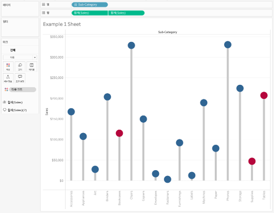

## 학습 목표

- 롤리팝 차트의 개념과 활용 목적을 이해합니다.
- 막대 차트와 비교했을 때 롤리팝 차트가 적합한 상황을 설명할 수 있습니다.
- Tableau에서 이중 축을 활용해 롤리팝 차트를 구현할 수 있습니다.

## 목차

1. 롤리팝 차트란?
2. 롤리팝 차트를 자주 쓰는 이유
3. Tableau에서 롤리팝 차트 만드는 방법

## 1. 롤리팝 차트란?

롤리팝 차트는 막대 차트와 끝점(Point)으로 값을 표현하는 차트로, 항목 간 크기 비교를 깔끔하게 보여주는 시각화 방식입니다.

- 선은 값의 길이를 보여주고
- 점은 최종 위치를 강조합니다.

즉, 막대 차트보다 더 가볍고 정돈된 인상을 주면서도 값 비교 기능은 유지할 수 있습니다.

## 2. 롤리팝 차트를 자주 쓰는 이유

롤리팝 차트는 막대 전체 면적보다 `끝점의 위치 비교`가 더 중요한 경우에 적합합니다.

대표적인 활용 예시는 다음과 같습니다.

- 항목별 점수 비교
- 제품 만족도 순위 표현
- 지표 간 크기 비교

실무적으로는 다음과 같은 장점이 있습니다.

- 막대보다 시각적 부담이 적습니다.
- 값 차이를 깔끔하게 보여주기 좋습니다.
- 강조할 특정 항목만 색을 다르게 두기 쉽습니다.

즉, 롤리팝 차트는 `간결한 비교형 차트`가 필요할 때 유용합니다.

## 3. Tableau에서 롤리팝 차트 만드는 방법

이미지처럼 롤리팝 차트는 막대 또는 얇은 선과 끝점 원을 `이중 축`으로 겹쳐 만듭니다.

구성 순서는 다음과 같습니다.

1. 범주 차원(예: `Sub-Category`)을 `열`에 배치합니다.
2. 측정값(예: `매출`)을 `행`에 두 번 올립니다.
3. 첫 번째 마크는 얇은 막대 또는 선처럼 보이도록 조정합니다.
4. 두 번째 마크는 `원(Circle)`으로 바꿉니다.
5. 두 축을 `이중 축(Dual Axis)`으로 맞춥니다.
6. 점 크기를 키워 끝값을 강조하고, 선 색은 중립적으로 둡니다.
7. 특정 항목만 별도 색으로 강조해 메시지를 분명히 합니다.

예시 화면 기준 구성은 다음과 같습니다.

- `열`: Sub-Category
- `행`: 매출, 매출
- 첫 번째 마크: 선 또는 얇은 막대
- 두 번째 마크: 원

롤리팝 차트는 막대 차트보다 시각적 무게가 가볍기 때문에, 항목 수가 많아도 비교가 비교적 깔끔합니다.  
다만 값 차이가 매우 작으면 점 위치가 겹칠 수 있으므로 정렬과 라벨 간격을 같이 조정하는 편이 좋습니다.
