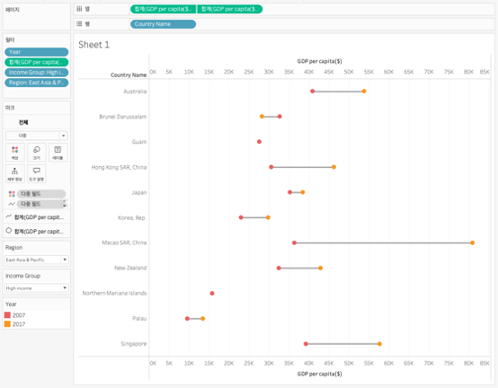

## 학습 목표

- 덤벨 차트의 개념과 활용 목적을 이해합니다.
- 두 시점 또는 두 그룹 간 차이를 해석할 수 있습니다.
- Tableau에서 이중 축을 활용해 덤벨 차트를 구현할 수 있습니다.

## 목차

1. 덤벨 차트란?
2. 덤벨 차트를 자주 쓰는 이유
3. Tableau에서 덤벨 차트 만드는 방법

## 1. 덤벨 차트란?

덤벨 차트는 하나의 항목에 대해 두 시점 또는 두 그룹의 값을 양쪽 점(Point)으로 표시하고, 그 사이를 선으로 연결하여 차이를 강조하는 비교 중심 차트입니다.

- 시작점과 끝점을 동시에 보여줄 수 있습니다.
- 두 값의 차이를 선 길이로 직관적으로 읽을 수 있습니다.
- 단순 막대 비교보다 변화량과 격차가 더 선명하게 보입니다.

즉, 덤벨 차트는 `두 값 사이의 거리`를 보여주는 데 강한 차트입니다.

## 2. 덤벨 차트를 자주 쓰는 이유

덤벨 차트는 값의 변화량이나 집단 간 격차를 직관적으로 보여줄 수 있기 때문에 비교 분석에서 자주 사용됩니다.

대표적인 활용 예시는 다음과 같습니다.

- 전년 대비 성과 변화 비교
- 남녀 지표 차이 표현
- 정책 적용 전후 결과 비교

실무에서는 다음 질문에 답할 때 특히 유용합니다.

- 어떤 항목의 변화 폭이 가장 큰가?
- 두 집단 간 격차가 큰 항목은 무엇인가?
- 방향이 좋아진 항목과 나빠진 항목은 무엇인가?

즉, 덤벨 차트는 단순 순위보다 `변화의 폭`과 `격차`를 읽는 데 적합합니다.

## 3. Tableau에서 덤벨 차트 만드는 방법

이미지처럼 덤벨 차트는 한 항목에 대해 두 측정값을 좌우 점으로 두고, 그 사이를 선으로 연결하는 방식으로 만듭니다.

구성 순서는 다음과 같습니다.

1. 비교할 두 시점 또는 두 그룹 측정값을 준비합니다.
2. 항목 차원(예: 국가명)을 `행`에 배치합니다.
3. 두 측정값을 `열`에 각각 올립니다.
4. 한 축은 `원(Circle)` 마크로 설정합니다.
5. 다른 축은 `선(Line)` 또는 `Gantt` 기반 연결선 역할을 하도록 구성합니다.
6. 두 축을 `이중 축(Dual Axis)`으로 맞추고 축 동기화를 확인합니다.
7. 두 점은 서로 다른 색으로 두고, 연결선은 중립색으로 정리합니다.

예시 화면 기준 구성은 다음과 같습니다.

- `행`: Country Name
- `열`: GDP per capita(두 시점)
- `마크`: 점 + 연결선
- `필터`: Year

덤벨 차트는 막대 차트보다 두 값 사이의 격차를 더 직접적으로 보여줍니다.  
실무에서는 차이 기준으로 정렬하면 어떤 항목에서 변화 폭이 큰지 훨씬 빨리 읽을 수 있습니다.
