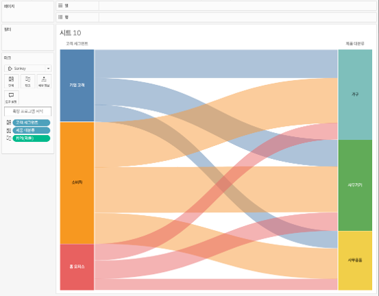

## 학습 목표

- 생키 차트의 개념과 활용 목적을 이해합니다.
- 흐름의 방향성과 규모를 동시에 해석할 수 있습니다.
- Tableau에서 생키 차트를 구현하는 원리와 현실적인 대안을 구분할 수 있습니다.

## 목차

1. 생키 차트란?
2. 생키 차트를 자주 쓰는 이유
3. Tableau에서 생키 차트 만드는 방법

## 1. 생키 차트란?

생키 차트는 데이터의 흐름과 이동량을 선의 두께로 표현하여, 출발 지점과 도착 지점 간의 관계 및 흐름 규모를 시각적으로 보여주는 차트입니다.

- 출발점과 도착점을 동시에 보여줄 수 있습니다.
- 흐름의 방향성과 양을 함께 표현할 수 있습니다.
- 각 흐름의 규모 차이를 두께로 직관적으로 읽을 수 있습니다.

즉, 생키 차트는 `어디서 어디로 얼마나 이동했는가`를 보여주는 데 강한 차트입니다.

## 2. 생키 차트를 자주 쓰는 이유

생키 차트는 전환 과정이나 분배 구조를 이해할 때 효과적입니다.

대표적인 활용 예시는 다음과 같습니다.

- 고객 유입 경로 분석
- 채널별 전환 흐름 표현
- 에너지 또는 비용 흐름 구조 시각화

실무에서는 단순 비율 차트만으로는 놓치기 쉬운 다음 질문에 답할 수 있습니다.

- 어떤 경로로 가장 많이 이동하는가?
- 어느 구간에서 흐름이 크게 줄어드는가?
- 특정 출발점이 어떤 도착점으로 주로 연결되는가?

즉, 생키 차트는 `구조`와 `규모`를 동시에 읽는 데 적합합니다.

## 3. Tableau에서 생키 차트 만드는 방법

이미지처럼 생키 차트는 확장 프로그램을 활용하면 가장 빠르게 구현할 수 있습니다. 직접 구현도 가능하지만, 실무에서는 보통 확장 프로그램 기반 접근을 먼저 고려합니다.

확장 프로그램 기준 구성 순서는 다음과 같습니다.

1. `출발 노드`, `도착 노드`, `흐름 크기` 필드를 준비합니다.
2. 확장 프로그램 시트 또는 전용 마크 유형을 사용합니다.
3. 출발 노드와 도착 노드를 각각 연결 필드에 배치합니다.
4. 흐름 크기를 `크기(Size)`에 연결합니다.
5. 출발 그룹이나 도착 그룹을 기준으로 색상을 지정합니다.
6. 레이블과 순서를 정리해 읽기 쉬운 흐름 구조로 만듭니다.

예시 화면 기준 핵심 구성은 다음과 같습니다.

- 왼쪽: 고객 세그먼트
- 오른쪽: 세부 범주
- 연결 폭: 흐름 크기
- 색상: 출발 그룹 기준

직접 구현하려면 `Sigmoid` 곡선 계산, 경로 생성, Polygon 좌표 설계까지 필요해 난이도가 높습니다.  
따라서 생키 차트는 `빠르게 구현할 것인지`, `표현 자유도를 높일 것인지`를 먼저 결정한 뒤 접근하는 것이 가장 실무적입니다.
