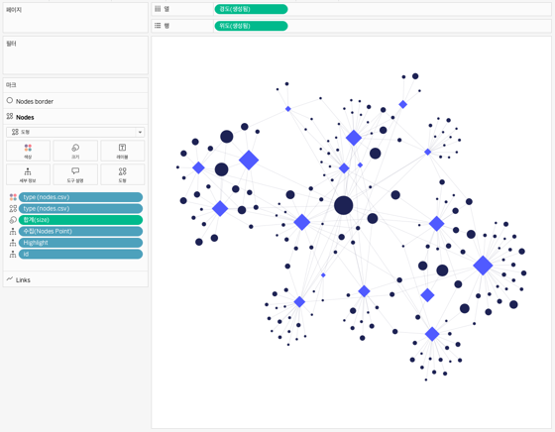

## 학습 목표

- 네트워크 차트의 개념과 활용 목적을 이해합니다.
- 노드와 링크를 통해 관계 구조를 해석할 수 있습니다.
- Tableau에서 네트워크 차트를 구현하는 현실적인 방법을 구분할 수 있습니다.

## 목차

1. 네트워크 차트란?
2. 네트워크 차트를 자주 쓰는 이유
3. Tableau에서 네트워크 차트 만드는 방법

## 1. 네트워크 차트란?

네트워크 차트는 노드(Node)와 연결선(Link)을 통해 개체 간 관계와 연결 구조를 표현하는 그래프 기반 시각화 차트입니다.

- 노드는 사람, 시스템, 채널, 조직 같은 개체를 의미합니다.
- 링크는 두 개체 사이의 관계 또는 흐름을 의미합니다.

즉, 개별 값 자체보다 `누가 누구와 연결되어 있는가`를 보는 데 초점이 있습니다.

## 2. 네트워크 차트를 자주 쓰는 이유

네트워크 차트는 개별 요소보다 관계성과 연결 패턴을 중심으로 분석할 수 있어, 영향력 구조나 상호작용 흐름을 파악하는 데 적합합니다.

대표적인 활용 예시는 다음과 같습니다.

- 조직 협업 관계 표현
- 사용자 간 연결 구조 분석
- 시스템 간 데이터 흐름 시각화

실무에서는 다음과 같은 질문에 답할 때 유용합니다.

- 연결이 가장 많은 핵심 노드는 무엇인가?
- 어떤 그룹끼리 강하게 묶여 있는가?
- 특정 노드가 제거되면 구조가 크게 바뀌는가?

즉, 네트워크 차트는 `값의 크기`보다 `연결 구조`를 읽는 데 강합니다.

## 3. Tableau에서 네트워크 차트 만드는 방법

이미지처럼 네트워크 차트는 확장 프로그램 또는 전용 네트워크 시각화 구성으로 만드는 것이 가장 현실적입니다.

구성 순서는 다음과 같습니다.

1. 노드 데이터와 링크 데이터를 준비합니다.
2. 노드 식별자, 링크 시작점, 링크 끝점, 연결 강도 필드를 정리합니다.
3. 확장 프로그램 또는 네트워크용 시각화 시트에서 `Nodes`와 `Links`를 각각 매핑합니다.
4. 노드 크기에는 연결 수나 중요도 지표를 넣습니다.
5. 노드 색상에는 유형, 그룹, 커뮤니티 구분 필드를 넣습니다.
6. 링크 두께나 투명도에는 연결 강도를 반영합니다.
7. 특정 노드를 강조할 수 있도록 하이라이트 또는 필터를 추가합니다.

예시 화면 기준 핵심 구성은 다음과 같습니다.

- `Nodes`: 개체 정보
- `Links`: 연결 정보
- `크기`: 중요도 또는 연결 수
- `색상`: 노드 유형

네트워크 차트는 좌표를 직접 만들 수도 있지만, 실무에서는 레이아웃 계산 부담이 크기 때문에 확장 프로그램 접근이 보통 더 효율적입니다.  
핵심은 예쁘게 배치하는 것보다 `어떤 노드가 중심이고 어떤 그룹이 묶여 있는지` 읽히게 만드는 것입니다.
