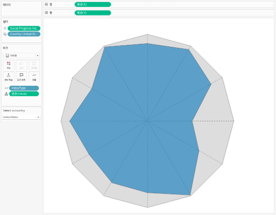

## 학습 목표

- 레이더 차트의 개념과 활용 목적을 이해합니다.
- 여러 지표의 균형과 패턴을 비교하는 방법을 설명할 수 있습니다.
- Tableau에서 계산된 필드와 경로 마크를 활용해 레이더 차트를 구현하는 원리를 이해합니다.

## 목차

1. 레이더 차트란?
2. 레이더 차트를 자주 쓰는 이유
3. Tableau에서 레이더 차트 만드는 방법

## 1. 레이더 차트란?

레이더 차트는 여러 지표를 방사형 축으로 배치하고, 값을 연결해 다각형 형태로 표현하여 항목별 성과 균형과 패턴을 비교하는 차트입니다.

- 각 축은 하나의 지표를 의미합니다.
- 중심에서 멀수록 값이 크다고 해석합니다.
- 여러 항목을 같은 축 구조 위에서 비교할 수 있습니다.

즉, 레이더 차트는 개별 수치보다 `지표의 균형과 모양`을 읽는 데 적합합니다.

## 2. 레이더 차트를 자주 쓰는 이유

레이더 차트는 하나의 대상이 여러 항목에서 어떤 강점과 약점을 가지는지 직관적으로 보여줄 수 있습니다.

대표적인 활용 예시는 다음과 같습니다.

- 제품 성능 지표 비교
- 조직 역량 평가 시각화
- 브랜드별 평가 항목 비교

실무에서는 다음 질문에 답할 때 유용합니다.

- 특정 대상이 어떤 항목에서 강한가?
- 여러 대상의 패턴이 비슷한가, 다른가?
- 전반적으로 균형 잡힌 성과를 보이는가?

즉, 레이더 차트는 `총점`보다 `구성 패턴`을 읽는 데 강합니다.

## 3. Tableau에서 레이더 차트 만드는 방법

이미지처럼 레이더 차트는 `X`, `Y` 좌표 계산 필드와 `다각형(Path)` 마크를 이용해 구현합니다.

구성 순서는 다음과 같습니다.

1. 지표별 각도 값을 계산합니다.
2. 각 지표 값을 반지름 값처럼 사용하도록 정규화합니다.
3. 삼각함수로 `X = 값 * COS(각도)`, `Y = 값 * SIN(각도)` 형태의 좌표 계산식을 만듭니다.
4. `열`에 `합계(X)`, `행`에 `합계(Y)`를 배치합니다.
5. 마크 유형을 `다각형(Polygon)`으로 바꿉니다.
6. 지표 순서 필드를 `경로(Path)`에 넣어 다각형이 올바른 순서로 연결되게 합니다.
7. 배경용 기준 다각형을 함께 두면 해석이 쉬워집니다.

예시 화면 기준 핵심 구성은 다음과 같습니다.

- `열`: 합계(X)
- `행`: 합계(Y)
- `마크`: 다각형
- `경로`: 지표 순서

레이더 차트는 구현보다 `정규화`가 더 중요합니다.  
축 범위가 다르면 실제보다 특정 지표가 과장되어 보일 수 있으므로, 비교용 레이더 차트는 같은 기준으로 스케일을 맞춘 뒤 그리는 것이 필수입니다.
