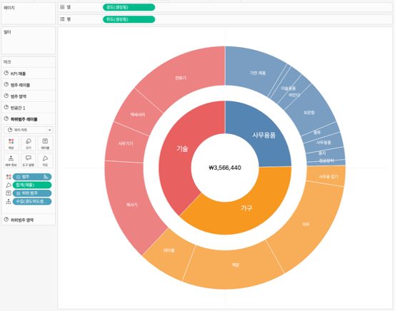

## 학습 목표

- 썬버스트 차트의 개념과 활용 목적을 이해합니다.
- 계층 구조 데이터의 구성 관계와 비중을 해석할 수 있습니다.
- Tableau에서 썬버스트 차트를 구현하는 기본 흐름을 이해합니다.

## 목차

1. 썬버스트 차트란?
2. 썬버스트 차트를 자주 쓰는 이유
3. Tableau에서 썬버스트 차트 만드는 방법

## 1. 썬버스트 차트란?

썬버스트 차트는 계층 구조 데이터를 원형으로 확장하며 표현하여, 상위 항목부터 하위 항목까지의 구성 관계와 비율을 동시에 보여주는 차트입니다.

- 중심에 가까울수록 상위 계층입니다.
- 바깥쪽으로 갈수록 하위 계층이 펼쳐집니다.
- 각 조각의 크기로 비중을 함께 표현할 수 있습니다.

즉, 썬버스트 차트는 `계층 구조`와 `구성 비율`을 한 화면에서 함께 읽는 데 강합니다.

## 2. 썬버스트 차트를 자주 쓰는 이유

썬버스트 차트는 중심에서 바깥 방향으로 계층이 확장되기 때문에, 데이터 구조와 구성 비중을 직관적으로 이해하는 데 적합합니다.

대표적인 활용 예시는 다음과 같습니다.

- 제품 카테고리 → 세부 상품 구성 분석
- 조직 구조 계층 표현
- 서비스 메뉴 구조 시각화

실무에서는 다음 질문에 답할 때 유용합니다.

- 어떤 상위 범주가 전체에서 가장 큰 비중을 차지하는가?
- 그 안에서 어떤 하위 항목이 핵심인가?
- 계층 구조가 한 단계 아래로 갈수록 어떻게 분포하는가?

즉, 썬버스트 차트는 트리맵과 비슷하게 계층 구조를 보여주지만, 원형 구조 덕분에 `상위-하위 확장 관계`를 더 직관적으로 전달하는 데 유리할 수 있습니다.

## 3. Tableau에서 썬버스트 차트 만드는 방법

이미지처럼 썬버스트 차트는 계층별 링을 여러 겹의 원형 구조로 구성해 만듭니다.

구성 순서는 다음과 같습니다.

1. 상위 계층과 하위 계층 차원을 준비합니다.
2. 각 계층의 비중을 계산합니다.
3. 안쪽 링에는 상위 계층, 바깥 링에는 하위 계층이 오도록 구조를 나눕니다.
4. 각 링이 원형 영역처럼 보이도록 이중 축과 원형 마크 구성을 만듭니다.
5. 색상은 상위 계층 기준으로 묶고, 하위 계층은 같은 계열 안에서 구분합니다.
6. 중앙에는 전체 합계나 핵심 KPI를 배치하면 해석이 쉬워집니다.

예시 화면 기준 핵심 구성은 다음과 같습니다.

- 안쪽 링: 상위 범주
- 바깥 링: 하위 범주
- 중앙 텍스트: 전체 합계
- 색상: 상위 범주 기준 계열화

썬버스트 차트는 계층 구조가 명확할 때 강하지만, 레이블이 많아지면 급격히 복잡해집니다.  
실무에서는 모든 하위 항목을 다 보여주기보다, 핵심 하위 범주만 남기거나 상위 1~2단계까지만 쓰는 편이 읽기 좋습니다.
