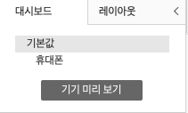
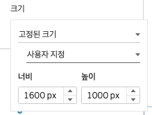
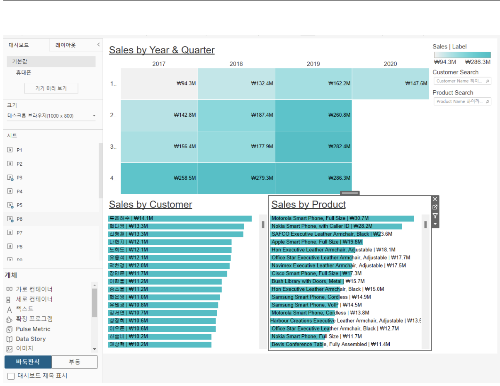
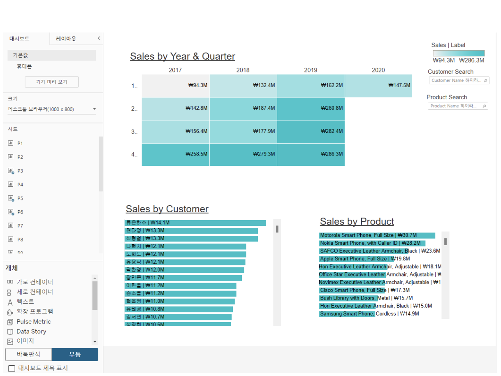
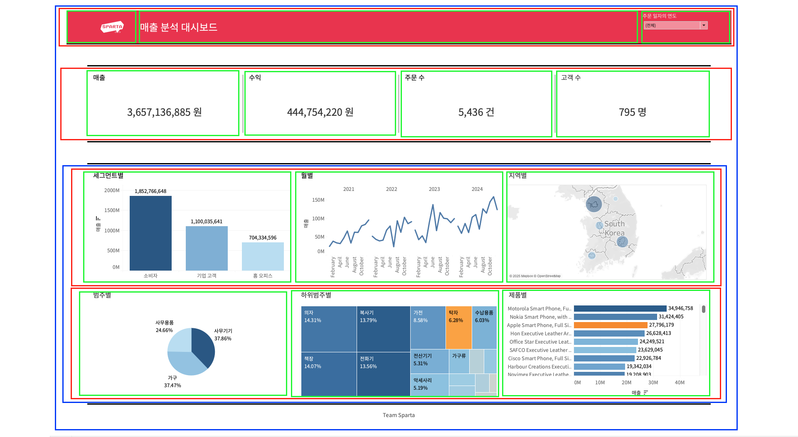
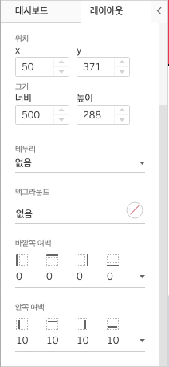
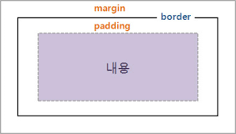

## 학습 목표

- 장치별 레이아웃, 대시보드 크기, 개체 활용 등 Tableau의 주요 기능을 이해할 수 있습니다.
- 대시보드 레이아웃 옵션의 차이를 구분하고, 목적에 맞게 적용할 수 있습니다.
- 레이아웃 컨테이너와 개체를 활용해 실무형 대시보드를 구성할 수 있습니다.

## 목차

1. 대시보드 구성

## 1. 대시보드 구성

이번 절에서는 앞에서 정리한 대시보드 설계 원칙을 실제 Tableau Desktop 화면 구성 기능으로 연결합니다.  
좋은 대시보드를 만들기 위해서는 차트만 잘 만드는 것이 아니라, `어떤 장치에서 볼 것인지`, `화면 크기를 어떻게 둘 것인지`, `개체를 어떤 방식으로 배치할 것인지`까지 함께 설계해야 합니다.

특히 실무에서는 같은 대시보드라도 다음과 같은 상황 차이가 자주 발생합니다.

- 사내 PC에서 주로 보는가
- 노트북과 프로젝터를 함께 쓰는가
- 태블릿이나 휴대폰에서도 열어보는가
- 경영 보고용처럼 고정 레이아웃이 중요한가
- 운영 모니터링처럼 다양한 장치에서 접근해야 하는가

즉, 대시보드 구성은 디자인의 마지막 단계가 아니라 `사용 환경을 실제 화면으로 구현하는 단계`입니다.

### 1-1. 장치별 레이아웃

Tableau는 하나의 대시보드에 대해 장치별 레이아웃(Device Layout)을 따로 구성할 수 있습니다.

지원되는 대표 장치 유형은 다음과 같습니다.

- 데스크탑
- 태블릿
- 휴대폰

이 기능의 핵심은 `상위 대시보드 하나를 기준으로, 장치별 하위 레이아웃을 따로 조정할 수 있다`는 점입니다.

즉, 기본 대시보드를 먼저 만들고 나서:

- 데스크탑에서는 넓은 화면 기준으로 유지하고
- 태블릿에서는 일부 차트를 재배치하고
- 휴대폰에서는 핵심 KPI만 남기고 단순화하는

식의 대응이 가능합니다.

#### 왜 중요한가요?

같은 화면을 모든 장치에 그대로 보여주면 다음 문제가 쉽게 생깁니다.

- 데스크탑에서는 잘 보이지만 모바일에서는 글자가 너무 작음
- 가로 배치가 모바일에서 세로로 밀리며 읽기 어려워짐
- 필터와 범례가 본문보다 더 많은 공간을 차지함
- 핵심 KPI보다 보조 차트가 먼저 보이는 구조가 됨

즉, 장치별 레이아웃은 보기 좋게 바꾸는 기능이 아니라 `장치별 사용 경험을 재설계하는 기능`입니다.

#### 실무적으로 기억할 점

- 데스크탑 레이아웃은 정보량을 충분히 담을 수 있습니다.
- 태블릿 레이아웃은 가독성과 터치 사용성을 함께 고려해야 합니다.
- 휴대폰 레이아웃은 핵심 정보만 남기는 편이 일반적으로 더 좋습니다.

하나의 대시보드가 여러 환경에서 쓰일수록, 장치별 레이아웃 기능의 중요성은 더 커집니다.

### 1-2. 대시보드 크기

Tableau 대시보드 크기 설정은 크게 다음 세 가지 방식으로 나뉩니다.

- 고정 크기(Fixed Size)
- 자동(Automatic)
- 범위(Range)

| 옵션 | 특징 | 장점 | 단점 | 활용 예시 |
| --- | --- | --- | --- | --- |
| 고정 크기 (Fixed Size) | 지정한 너비와 높이(px)로만 표시 | 레이아웃이 항상 동일하게 유지 | 다른 해상도에서는 스크롤 또는 잘림 발생 가능 | 특정 해상도 전용 보고용 대시보드 |
| 자동 (Automatic) | 화면 크기에 따라 자동 확대/축소 | 다양한 기기에서 보기 편리 | 비율 차이로 왜곡 또는 밀림이 생길 수 있음 | 여러 사용자 환경에서 공유되는 대시보드 |
| 범위 (Range) | 최소/최대 크기 범위 안에서 조정 | 안정성과 유연성 모두 확보 가능 | 범위를 벗어나면 스크롤이 생길 수 있음 | 사내 PC, 노트북, 회의실 화면 등 다양한 환경 고려 |

#### 1. 고정 크기

고정 크기는 가장 예측 가능한 방식입니다.

- 보고서 캡처 품질을 일정하게 유지하기 쉽고
- 레이아웃이 무너지지 않으며
- 발표용, PDF용, 특정 모니터 기준 대시보드에 적합합니다.

반면 단점도 분명합니다.

- 화면이 작으면 잘릴 수 있고
- 화면이 크면 여백이 지나치게 넓어질 수 있으며
- 여러 해상도 환경에 유연하지 않습니다.

즉, 고정 크기는 `정확한 배치`가 중요한 경우에 강하고, `다양한 환경 대응`에는 약합니다.

#### 2. 자동

자동은 화면 크기에 맞게 대시보드가 유연하게 반응합니다.

장점은 명확합니다.

- 다양한 화면에서 보기 편하고
- 별도 크기 계산 없이 공유하기 쉽고
- 웹 배포 환경에서 접근성이 좋습니다.

하지만 자동은 항상 좋은 선택은 아닙니다.

- 요소 간 비율이 어색해질 수 있고
- 차트가 너무 넓어지거나 압축될 수 있으며
- 의도한 시선 흐름이 흐트러질 수 있습니다.

즉, 자동은 `범용성`은 좋지만 `정밀한 화면 통제력`은 낮아질 수 있습니다.

#### 3. 범위

범위는 고정과 자동의 중간에 가까운 옵션입니다.

- 최소 크기와 최대 크기를 설정할 수 있고
- 그 안에서는 유연하게 대응하며
- 너무 작은 화면 또는 너무 큰 화면에서의 극단적 왜곡을 줄이는 데 유리합니다.

실무에서는 이 옵션이 생각보다 유용합니다.  
특히 동일 조직 내에서도 노트북, 외부 모니터, 회의실 스크린처럼 다양한 환경이 섞여 있을 때 균형 잡힌 선택이 될 수 있습니다.

#### 어떤 옵션을 선택해야 할까요?

- 배포 결과가 항상 동일해야 하면 `고정 크기`
- 여러 장치와 웹 환경을 폭넓게 고려하면 `자동`
- 안정성과 유연성을 함께 원하면 `범위`

즉, 크기 설정은 단순한 화면 옵션이 아니라 `배포 환경 전략`에 가까운 선택입니다.

### 1-3. 바둑판식(Tiled)과 부동(Floating)

Tableau에서 개체를 배치하는 방식은 크게 두 가지입니다.

- 바둑판식(Tiled)
- 부동(Floating)

이 차이는 대시보드 편집에서 매우 중요합니다.  
왜냐하면 같은 차트와 같은 텍스트를 넣더라도, 어떤 배치 방식을 쓰느냐에 따라 수정 편의성과 레이아웃 안정성이 크게 달라지기 때문입니다.

#### 1. 바둑판식(Tiled)

바둑판식은 개체가 격자처럼 정렬되며 자동으로 자리 잡는 방식입니다.

특징은 다음과 같습니다.

- 객체들이 서로 밀어내며 배치됩니다.
- 컨테이너 안에서 구조적으로 정리하기 쉽습니다.
- 크기 조정 시 전체 레이아웃의 균형을 맞추기 좋습니다.

장점은 다음과 같습니다.

- 구조가 안정적입니다.
- 수정할 때 전체 레이아웃이 덜 깨집니다.
- 협업 시 다른 사람이 수정해도 상대적으로 예측 가능합니다.

즉, 바둑판식은 `운영과 유지보수에 강한 방식`입니다.

#### 2. 부동(Floating)

부동은 개체를 다른 요소 위에 자유롭게 겹쳐 놓거나, 정확한 위치에 직접 배치하는 방식입니다.

특징은 다음과 같습니다.

- 자유로운 위치 배치가 가능합니다.
- 겹침 효과나 배경 위 카드 배치에 유리합니다.
- 세밀한 픽셀 단위 조정이 가능합니다.

장점은 다음과 같습니다.

- 디자인 자유도가 높습니다.
- KPI 카드, 버튼, 배지, 로고 같은 장식적 요소를 얹기 좋습니다.
- 대시보드에 시각적 강조를 줄 수 있습니다.

하지만 단점도 분명합니다.

- 수정하다 보면 겹침이나 정렬 붕괴가 생기기 쉽습니다.
- 해상도나 크기 변화에 더 취약할 수 있습니다.
- 구조 파악이 어려워 유지보수가 불편해질 수 있습니다.

즉, 부동은 `표현력`은 강하지만 `구조 안정성`은 떨어질 수 있습니다.

#### 언제 무엇을 쓰면 좋을까요?

- 기본 골격과 메인 구조는 `바둑판식`
- 강조 카드, 버튼, 이미지 오버레이, 장식성 요소는 `부동`

이 조합이 실무에서 가장 많이 쓰이는 패턴입니다.

즉, 바둑판식과 부동은 둘 중 하나만 고르는 관계라기보다, `기본 구조는 바둑판식으로 잡고 필요한 부분만 부동으로 보완하는 방식`이 가장 안정적입니다.

### 1-4. 대시보드 개체

Tableau 대시보드에는 단순히 시트만 넣는 것이 아니라, 다양한 개체(Object)를 함께 배치할 수 있습니다.

| 개체 | 설명 |
| --- | --- |
| 가로 / 세로 | 개체를 그룹화하고 배치 흐름을 제어하는 레이아웃 컨테이너 |
| 텍스트 | 제목, 설명, 주석, 보조 정보 표시 |
| 이미지 | 로고, 아이콘, 배경 이미지, 링크 연결 등에 활용 |
| 웹 페이지 | 대시보드 안에 외부 웹 페이지 삽입 |
| 빈 페이지 | 개체 사이 간격 조정용 여백 요소 |
| 탐색 | 다른 대시보드, 시트, 스토리로 이동하는 버튼 역할 |
| 다운로드 | 사용자가 PDF, PNG, PowerPoint, Crosstab 등으로 다운로드 가능 |
| 확장 프로그램 | Tableau 외부 기능과 연결하거나 추가 기능 확장 |
| 데이터에 질문 | 사용자가 자연어 기반으로 데이터 탐색 질문 입력 가능 |

#### 실무에서 특히 자주 쓰이는 개체

실제로는 다음 개체를 가장 자주 씁니다.

- 가로/세로 컨테이너
- 텍스트
- 이미지
- 빈 페이지
- 탐색

이유는 대부분의 대시보드가 결국 다음 요소로 구성되기 때문입니다.

- 구조를 잡는 컨테이너
- 제목과 설명
- 필터와 차트 간 간격 조정
- 화면 이동 또는 세부 페이지 이동

즉, 개체 기능을 많이 아는 것도 중요하지만, 더 중요한 것은 `어떤 개체가 레이아웃의 뼈대를 만들고 어떤 개체가 보조 역할을 하는지`를 이해하는 것입니다.

#### 실습 레이아웃을 볼 때의 핵심

실습에서는 보통 다음처럼 구조를 해석하면 이해가 빠릅니다.

- 빨간색: 가로 컨테이너
- 파란색: 세로 컨테이너
- 초록색: 실제 개체

이렇게 보면 복잡해 보이는 대시보드도 사실은 `컨테이너 안에 개체를 반복적으로 배치한 구조`라는 것을 쉽게 파악할 수 있습니다.

즉, Tableau 대시보드는 자유 배치처럼 보여도, 실전에서는 대부분 `컨테이너 기반 구조 설계`가 핵심입니다.

### 1-5. 레이아웃 개체

개체를 대시보드에 넣은 뒤에는 레이아웃 패널에서 세부 속성을 조정할 수 있습니다.

대표 항목은 다음과 같습니다.

| 항목 | 설명 |
| --- | --- |
| 위치 (x, y) | 개체가 대시보드 안에서 배치되는 좌표 |
| 크기 (너비, 높이) | 개체의 가로/세로 크기 조정 |
| 테두리 | 개체 외곽선 추가 및 색상/굵기 지정 |
| 배경 | 개체의 배경색을 지정해 시각적 그룹 구분 |
| 바깥쪽 여백 (Margin) | 다른 개체와의 외부 간격 조정 |
| 안쪽 여백 (Padding) | 개체 내부 콘텐츠와 경계선 사이 간격 조정 |

이 설정은 단순 꾸미기 옵션처럼 보이지만, 실제로는 `정렬`, `가독성`, `정보 그룹화`, `시선 흐름`에 직접 영향을 줍니다.

#### 위치와 크기

위치와 크기는 특히 부동 개체(Floating)를 쓸 때 중요합니다.

- x: 가로 위치
- y: 세로 위치
- 너비/높이: 개체 크기

정확한 좌표로 맞추면 정교한 배치가 가능하지만, 동시에 유지보수는 더 어려워질 수 있습니다.

즉, 정밀한 제어가 필요한 경우에는 유용하지만, 모든 요소를 좌표 기반으로 다루는 것은 오히려 비효율적일 수 있습니다.

#### 테두리와 배경

테두리와 배경은 관련 정보 묶음을 시각적으로 나누는 데 유용합니다.

예를 들어:

- KPI 카드에 연한 배경색 적용
- 필터 영역과 본문 영역 배경 구분
- 특정 경고 영역에 테두리 강조

같은 방식으로 정보 그룹을 더 쉽게 읽게 만들 수 있습니다.

다만 과하게 사용하면 오히려 화면이 무거워질 수 있습니다.  
즉, 테두리와 배경은 많이 쓰는 것이 아니라 `필요한 곳만 쓰는 것`이 중요합니다.

#### 바깥쪽 여백(Margin)과 안쪽 여백(Padding)

여백은 레이아웃 품질을 크게 좌우하는 요소입니다.

- 안쪽 여백(Padding): 콘텐츠와 테두리 사이 여백
- 바깥쪽 여백(Margin): 개체와 다른 개체 사이 여백

쉽게 말하면:

- Padding은 개체 내부 숨 쉴 공간
- Margin은 개체 외부 간격 공간

입니다.

이 둘을 구분하지 못하면 다음 문제가 자주 생깁니다.

- 차트는 붙어 있는데 왜 답답해 보이는지 모름
- 카드 안의 숫자가 테두리에 너무 붙어 있음
- 요소 간 간격을 벌리고 싶은데 내부만 넓어짐

즉, Padding과 Margin은 비슷해 보여도 목적이 완전히 다릅니다.

| 구분 | 정의 | 적용 위치 | 특징 |
| --- | --- | --- | --- |
| 안쪽 여백 (Padding) | 콘텐츠와 테두리 사이의 여백 | 요소 내부 | 배경색과 함께 채워지며 내부 가독성을 높임 |
| 바깥쪽 여백 (Margin) | 요소와 다른 요소 사이의 여백 | 요소 외부 | 개체 간 거리 조정에 사용됨 |

실무에서는 보통 다음처럼 생각하면 편합니다.

- 텍스트가 박스 안에서 답답하면 `Padding`
- 요소끼리 너무 붙어 있으면 `Margin`

즉, 좋은 여백 설정은 디자인 감각 문제이기도 하지만, 동시에 `레이아웃 문제를 논리적으로 해결하는 기술`이기도 합니다.
