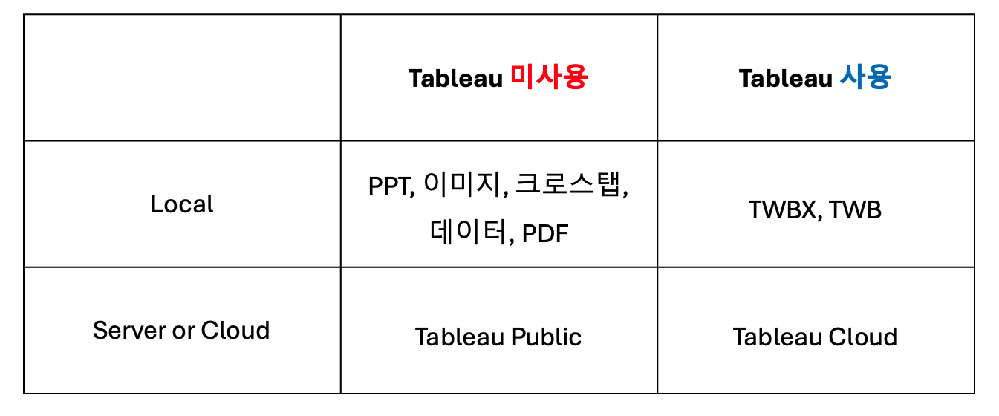
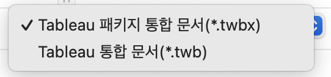
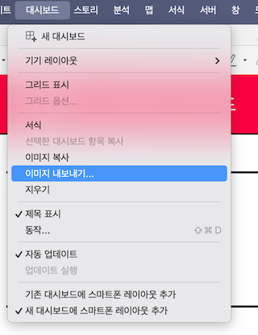
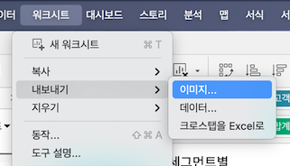
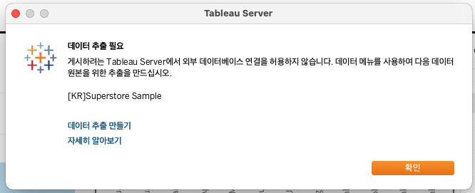
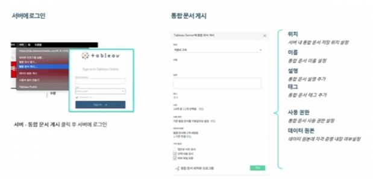

## 학습 목표

- 대시보드를 다양한 형식으로 내보낼 수 있습니다.
- Tableau Desktop에서 `twb`, `twbx` 파일 형식의 차이를 이해하고 적절하게 저장할 수 있습니다.
- Tableau Public에 시각화를 게시하고 공유하는 과정을 이해할 수 있습니다.

## 목차

1. 대시보드 저장 및 공유 방법: 로컬에서 공유
2. Tableau Public을 통한 공유

## 1. 대시보드 저장 및 공유 방법: 로컬에서 공유

### 1-1. Tableau 통합 문서

시각화를 만들었다면, 다음 단계는 결과를 저장하고 공유하는 것입니다.  
Tableau에서는 크게 두 가지 방식으로 공유할 수 있습니다.

- 파일로 공유
- Tableau Public에 게시해 공유

즉, Tableau 사용 여부와 관계없이 상황에 따라 가장 적합한 전달 방식을 선택할 수 있습니다.

#### Tableau 통합 문서(`.twb`, `.twbx`)

통합 문서로 저장하려면 상단 메뉴에서 `파일 -> 저장` 또는 `다른 이름으로 저장`을 사용합니다.

Tableau 통합 문서에는 대표적으로 두 가지 형식이 있습니다.

- 통합 문서(`.twb`)
- 패키지 통합 문서(`.twbx`)

#### `.twb`란?

- 하나 이상의 워크시트, 대시보드, 스토리 구조를 담은 통합 문서 파일입니다.
- 실제 원본 데이터 자체를 포함하지는 않습니다.
- 원본 데이터와 연결 정보를 바탕으로 동작합니다.

#### `.twbx`란?

- 통합 문서 + 로컬 데이터 파일 + 이미지 자산 등을 하나로 묶은 패키지 파일입니다.
- 내부적으로는 zip 형태의 단일 파일에 가깝습니다.
- 다른 사람과 전달하거나 백업할 때 유용합니다.

#### 언제 무엇을 써야 하는가

- 혼자 작업하거나 데이터 원본이 이미 공유 환경에 있으면 `.twb`도 충분할 수 있습니다.
- 원본 데이터 접근 권한이 없는 사람과 파일을 주고받아야 하면 `.twbx`가 안전합니다.

실무적으로는 이 차이가 매우 중요합니다.  
`.twb`만 전달하면 상대방 환경에 원본 데이터가 없을 때 파일이 열려도 정상적으로 분석이 재현되지 않을 수 있습니다.

### 1-2. PowerPoint로 내보내기

Tableau는 대시보드를 PowerPoint 형식으로 내보낼 수 있습니다.

상단 메뉴에서 `파일 -> PowerPoint로 내보내기`를 선택하면 됩니다.

이 기능은 보고용 자료를 빠르게 만드는 데 유용하지만, 중요한 특징이 있습니다.

- 각 워크시트가 별도 개체로 편집 가능한 것이 아닙니다.
- 대시보드가 하나의 이미지 형태로 들어가는 경우가 많습니다.

즉, PowerPoint는 발표와 공유에는 좋지만, 세부 시각화 요소를 PPT 안에서 다시 편집하려는 목적에는 한계가 있습니다.

### 1-3. 이미지 내보내기(PNG)

대시보드나 워크시트를 정적인 결과물로 빠르게 공유하고 싶다면 이미지 내보내기가 가장 간단합니다.

- 대시보드에서는 `대시보드 -> 이미지로 내보내기`
- 워크시트에서는 `워크시트 -> 내보내기 -> 이미지`

이 기능은 다음 상황에서 특히 유용합니다.

- 메신저나 문서에 빠르게 삽입해야 할 때
- 보고서에 정적인 스냅샷이 필요할 때
- Tableau가 없는 사용자에게 결과만 보여주고 싶을 때

다만 이미지로 내보내면 상호작용 기능은 모두 사라집니다.  
필터, 툴팁, 드릴다운 같은 Tableau의 강점은 유지되지 않습니다.

### 1-4. 크로스탭을 Excel로

워크시트가 크로스탭 형태일 경우 Excel로 내보낼 수도 있습니다.

메뉴 경로:

- `워크시트 -> 내보내기 -> 크로스탭을 Excel로`

이 기능은 시각화를 그대로 전달하는 것보다, 숫자 자체를 전달해야 할 때 유용합니다.

예를 들어:

- 경영진이 표 형태 데이터 검증을 원할 때
- 운영팀이 엑셀에서 추가 가공을 해야 할 때
- 차트보다 행/열 단위 숫자 비교가 중요한 경우

즉, Tableau는 시각화 툴이지만 필요에 따라 다시 표 형태 데이터 전달 도구로도 활용할 수 있습니다.

## 2. Tableau Public을 통한 공유

### 2-1. Tableau Public

Tableau Public은 만든 대시보드나 스토리를 공개적으로 게시할 수 있는 플랫폼입니다.

특징은 다음과 같습니다.

- 누구나 무료로 시각화를 게시할 수 있습니다.
- 전 세계 사용자가 만든 수많은 비주얼리제이션을 탐색할 수 있습니다.
- 개인 포트폴리오, 공개 프로젝트, 학습용 공유에 적합합니다.

Tableau Public 주소:

[Tableau Public](https://public.tableau.com/)

#### 주의할 점

Tableau Public은 말 그대로 공개 플랫폼입니다.  
따라서 민감 정보, 사내 데이터, 고객 식별 정보가 포함된 콘텐츠는 게시하면 안 됩니다.

즉, Public은 실무 운영 플랫폼이라기보다 공개 포트폴리오와 학습 공유 플랫폼으로 이해하는 것이 맞습니다.

### 2-2. Tableau Public에 게시

Tableau Public에 게시하려면 상단 메뉴에서 `서버 -> Tableau Public에 저장` 또는 `다른 이름으로 저장`을 선택합니다.

Public에 게시하기 위해서는 Public 계정을 먼저 생성해야 합니다.  
이 과정 자체는 비교적 간단하지만, 중요한 전제가 하나 있습니다.

#### 데이터 추출 만들기

Public에 게시하려면 데이터를 `추출(Extract)` 형태로 만들어야 하는 경우가 많습니다.

라이브와 추출의 차이는 뒤 챕터에서 자세히 다루겠지만, 여기서는 Public 게시 전에 추출 전환이 필요할 수 있다는 점만 기억하시면 됩니다.

#### 게시 화면

게시가 끝나면 Public에 생성된 URL을 다른 곳에 공유할 수 있습니다.
