## 학습 목표

- TabPy(Tableau Python Server)의 개념을 이해할 수 있습니다.
- TabPy 설치 및 환경 구성을 설명할 수 있습니다.
- TabPy를 활용한 클러스터링과 시계열 예측 흐름을 이해할 수 있습니다.

## 목차

1. TabPy (Tableau Python Server)란?
2. TabPy 설치
3. TabPy를 활용한 클러스터링
4. TabPy를 활용한 시계열 예측

## 1. TabPy (Tableau Python Server)란?

TabPy는 Tableau와 Python을 연결해주는 오픈소스 서버입니다.

즉, Tableau 안에서 Python 스크립트(머신러닝, 통계, 데이터 전처리 등)를 직접 실행할 수 있게 해주는 외부 서비스 게이트웨이입니다.

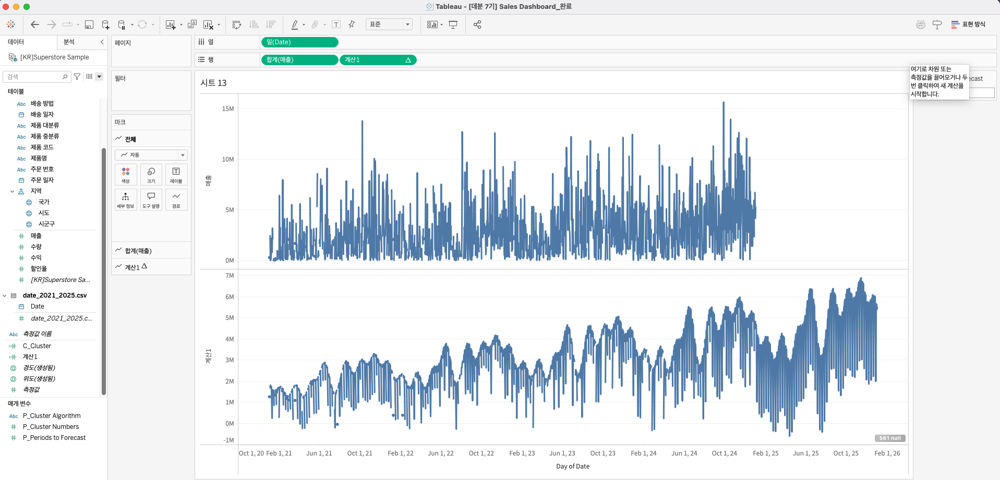

### 1-1. 구조

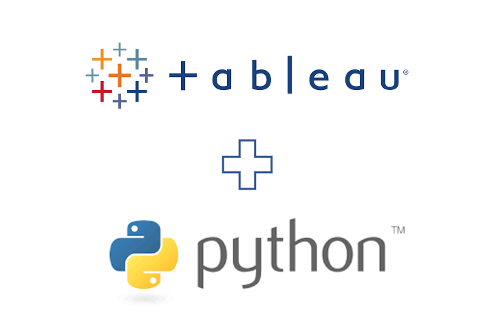

#### 1. Tableau SCRIPT

- Tableau 계산식 `SCRIPT_REAL`, `SCRIPT_INT`, `SCRIPT_STR`, `SCRIPT_BOOL` 안에서 Python 코드를 직접 호출할 수 있습니다.

예시:

```tableau
SCRIPT_REAL("import numpy as np
return np.mean(_arg1)", SUM([Sales]))
```

즉, Tableau의 `[Sales]` 데이터를 Python으로 보내서 `numpy.mean()`으로 평균을 구하는 방식입니다.

#### 2. Send Code to TabPy and Run it

- Tableau는 사용자가 작성한 Python 코드를 TabPy 서버로 전송합니다.
- TabPy는 Python이 설치된 환경에서 코드를 실행합니다.
- 이때 Python의 다양한 라이브러리(`numpy`, `pandas`, `scikit-learn` 등)를 활용할 수 있습니다.

즉, 머신러닝 모델 훈련, 예측, 통계 분석 등을 Tableau 안에서 수행할 수 있게 됩니다.

#### 3. Return a List back to Tableau

- Python이 실행 결과를 리스트 형태로 Tableau에 반환합니다.
- 예를 들어 Python이 계산한 예측값이나 통계 결과를 Tableau로 다시 보내면, Tableau는 그 값을 시트 또는 차트에 시각화합니다.

#### 4. Tableau Table Calc

- 반환된 값은 Tableau에서 일반 계산식처럼 사용할 수 있습니다.

즉, Tableau의 다른 필드들과 조합해서 그래프, KPI, 예측 차트 등을 만들 수 있습니다.

### 1-2. TabPy 문법

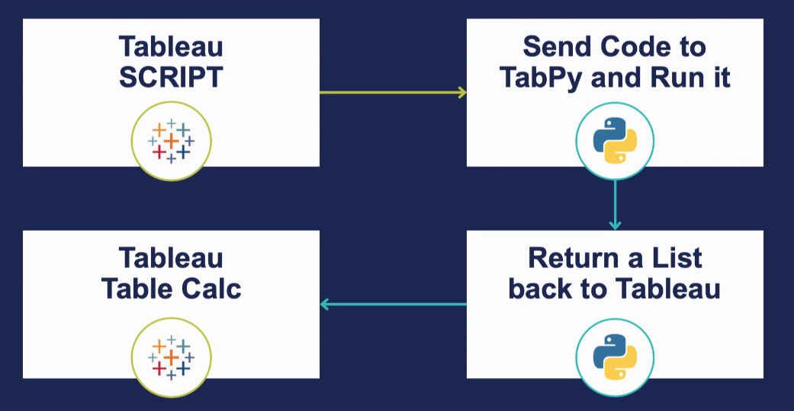

#### 1. `SCRIPT_REAL(" ... ")`

- 의미: Tableau가 TabPy 서버를 통해 Python 코드를 실행하도록 하는 Script 함수
- `REAL`은 숫자형(`float`) 결과를 반환할 때 사용

반환 타입은 다음과 같이 구분됩니다.

- `SCRIPT_REAL()` → 숫자형 결과
- `SCRIPT_INT()` → 정수형 결과
- `SCRIPT_STR()` → 문자열 결과
- `SCRIPT_BOOL()` → True / False 결과

#### 2. `text = _arg1`

- 의미: Tableau에서 넘겨준 첫 번째 인수(`_arg1`)를 Python 변수 `text`에 저장하는 부분
- `_arg1`, `_arg2`, `_arg3` 등은 Tableau가 전달하는 입력값으로, `SCRIPT` 함수 뒤에 쉼표(`,`)로 구분해 전달합니다.

즉, Tableau 필드가 Python 코드의 입력 변수로 들어오는 구조입니다.

#### 3. `ATTR([Comment])`

- 의미: Tableau 필드 `[Comment]`를 Python 코드의 `_arg1`로 전달하는 부분
- 즉, Tableau 시트의 댓글(`Comment`) 데이터 열이 Python 코드의 입력값으로 사용됩니다.

`ATTR()`은 중복값이 있더라도 단일 속성으로 취급해주는 Tableau 함수로, 집계 오류를 방지하기 위한 래핑 역할을 합니다.

### 1-3. 주요 특징

- 머신러닝 모델 연동
  - `scikit-learn`, `XGBoost`, `PyTorch`, `TensorFlow` 모델 학습 및 예측 가능
- 통계 분석
  - 회귀분석, 가설검정, 시계열 예측 등
- 데이터 전처리
  - `pandas`로 그룹핑, 변환, 이상치 처리 후 Tableau로 반환
- 실시간 계산
  - Tableau에서 파라미터를 바꾸면 Python 코드가 즉시 다시 실행됨

### 1-4. SCRIPT 함수와 함께 쓰기

Tableau에서 TabPy 호출 시 4가지 함수를 사용합니다.

| 함수 | 반환 타입 |
| --- | --- |
| SCRIPT_REAL | 실수(float) |
| SCRIPT_INT | 정수(int) |
| SCRIPT_STR | 문자열(str) |
| SCRIPT_BOOL | 논리값(bool) |

- [TabPy Tableau Help](https://help.tableau.com/current/prep/ko-kr/prep_scripts_TabPy.htm)
- [TabPy GitHub](https://github.com/tableau/TabPy)

## 2. TabPy 설치

Windows는 `cmd(명령 프롬프트)` 또는 `PowerShell`, Mac 또는 Linux는 `터미널(Terminal)`에서 실행합니다.

### 2-1. 패키지 설치 전 pip 업데이트

```bash
python -m pip install --upgrade pip
# python3 -m pip install --upgrade pip
```

### 2-2. TabPy 패키지 설치

```bash
pip install tabpy
```

### 2-3. 설치된 TabPy 실행

```bash
tabpy

# Do you wish to proceed without authentication? (y/N): 뜨면 y 엔터
```

### 2-4. 브라우저에서 확인

브라우저에서 [http://localhost:9004](http://localhost:9004) 에 접속해 TabPy REST API 페이지가 뜨면 정상입니다.

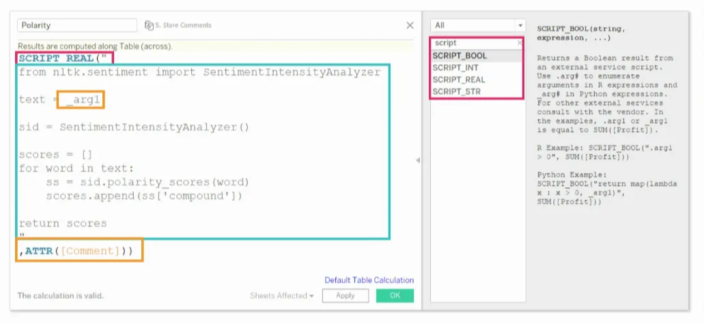

### 2-5. Tableau에서 TabPy 서버 연결

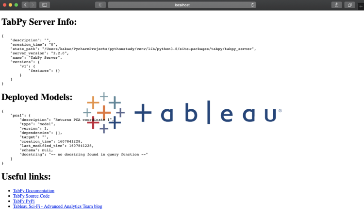

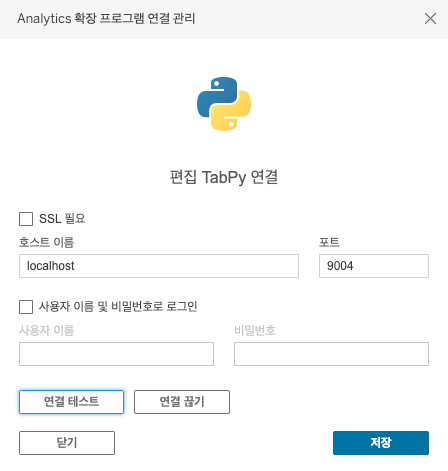

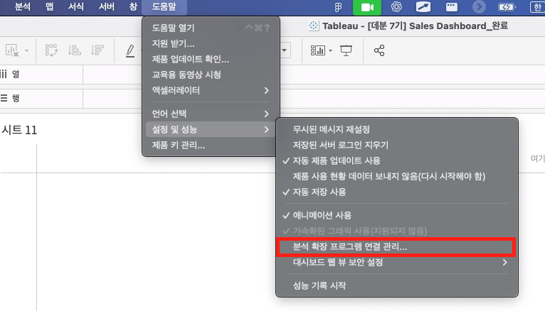

TabPy 연결 후 실행 시 일반적으로 다음 값을 사용합니다.

- 호스트 이름: `localhost` (TabPy가 설치된 IP)
- 포트: `9004` (기본값)

## 3. TabPy를 활용한 클러스터링

### 3-1. K-Means

K-Means는 가장 대표적인 비지도 학습(unsupervised learning) 알고리즘 중 하나로, 데이터를 K개의 그룹(클러스터)으로 나누는 방법입니다.

즉, 비슷한 데이터끼리 묶어 패턴이나 구조를 찾는 데 쓰입니다.

흐름은 다음과 같습니다.

1. 사용자가 만들고 싶은 클러스터 개수 `K`를 정합니다.
2. 임의로 `K`개의 중심점(centroid)을 초기값으로 둡니다.
3. 각 데이터를 가장 가까운 중심점에 할당합니다.
4. 각 클러스터의 평균값으로 중심점을 갱신합니다.
5. 중심점이 수렴할 때까지 반복합니다.

### 3-2. Mini-Batch KMeans

Mini-Batch KMeans는 일반적인 K-Means를 대규모 데이터셋에 더 효율적으로 적용할 수 있도록 개선한 방식입니다.

- 기존 K-Means는 매 반복마다 전체 데이터를 모두 계산해야 합니다.
- 대용량 데이터에서는 연산량과 메모리 사용량이 커집니다.
- Mini-Batch KMeans는 작은 배치(mini-batch) 단위로 무작위 샘플링하여 클러스터링을 진행합니다.

흐름은 다음과 같습니다.

1. 일반 K-Means처럼 `k`개의 중심점을 무작위로 설정합니다.
2. 전체 데이터에서 일부 배치를 랜덤하게 뽑아 사용합니다.
3. 샘플 데이터를 가장 가까운 중심점에 할당합니다.
4. 선택된 샘플 기준으로 중심점을 조금씩 업데이트합니다.
5. 여러 배치를 반복하며 수렴시킵니다.

### 3-3. P_Cluster Algorithm / P_Cluster Numbers 생성

클러스터링 실습을 위해 보통 다음 두 개의 매개변수를 생성합니다.

- `P_Cluster Algorithm`
- `P_Cluster Numbers`

첫 번째는 어떤 알고리즘을 쓸지, 두 번째는 클러스터 수를 몇 개로 할지 제어합니다.

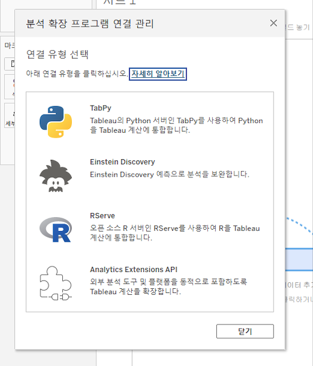

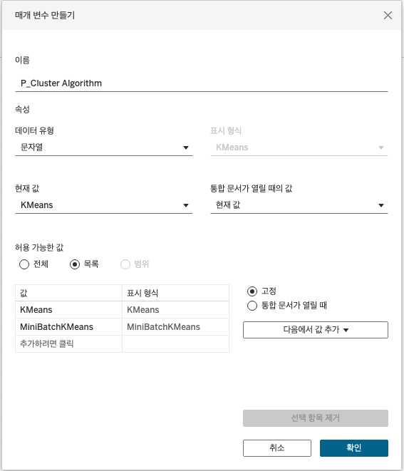

### 3-4. C_Cluster 계산식

```tableau
SCRIPT_INT("
import numpy as np
from sklearn.cluster import KMeans, MiniBatchKMeans

x1 = np.asarray(_arg1, dtype=np.float32)
x2 = np.asarray(_arg2, dtype=np.float32)
algo = _arg3[0]; k = int(_arg4[0])

X = np.column_stack((x1, x2))
n = X.shape[0]; k = max(1, min(k, n))

if algo == 'KMeans':
    labels = KMeans(n_clusters=k, n_init=5, random_state=59).fit_predict(X)
else:
    labels = MiniBatchKMeans(n_clusters=k, batch_size=20, random_state=59).fit_predict(X)

return labels.tolist()
",
SUM([매출]),
SUM([수익]),
[P_Cluster Algorithm],
[P_Cluster Numbers]
)
```

### 3-5. 스캐터 차트 뷰 구성

- 행: `SUM([매출])`
- 열: `SUM([수익])`
- 색상: `C_Cluster` (계산 대상: 제품명)
- 세부정보: 제품명

즉, 매출과 수익을 축으로 두고 제품을 점으로 놓은 뒤, Python에서 계산한 클러스터 라벨을 색상으로 입히는 구조입니다.

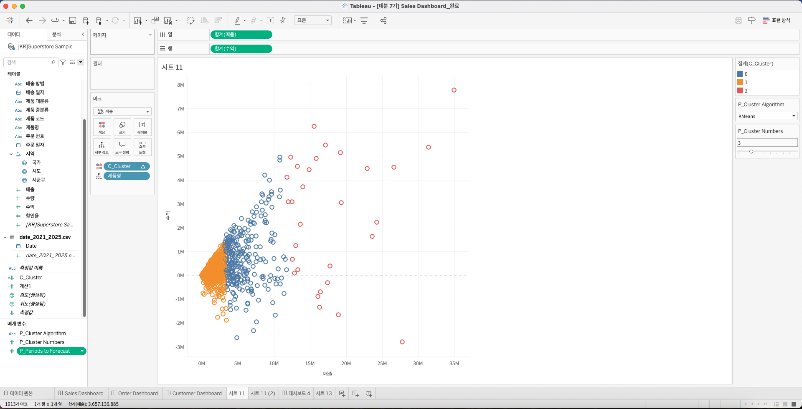

## 4. TabPy를 활용한 시계열 예측

### 4-1. Prophet

Prophet은 Facebook이 2017년에 공개한 시계열 데이터 예측용 오픈소스 라이브러리입니다.

- Python과 R에서 사용 가능
- 일별, 주별, 월별 시계열 데이터에 특히 강함
- 계절성(Seasonality), 추세(Trend), 휴일 효과(Holiday effects) 등을 자동으로 고려

즉, 비전문가도 비교적 쉽게 시계열 예측을 수행할 수 있도록 만든 라이브러리라고 볼 수 있습니다.

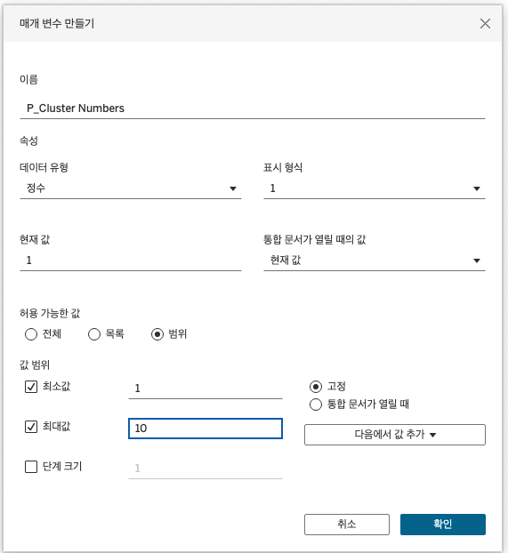

### 4-2. P_Periods to Forecast 생성

예측 실습을 위해 `P_Periods to Forecast` 매개변수를 생성해 미래 예측 기간을 제어합니다.

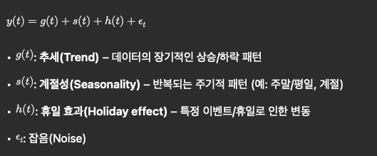

### 4-3. C_Time Series Forecasting 계산식

```tableau
SCRIPT_REAL("
import pandas as pd
import numpy as np
from prophet import Prophet

# 1) 스캐폴드(뷰의 전체 날짜)
scaf = pd.DataFrame({'ds': _arg1})
scaf['ds'] = pd.to_datetime(scaf['ds'], errors='coerce')
scaf = scaf.dropna().sort_values('ds')

# 2) 히스토리(실데이터) 구성
hist = pd.DataFrame({'ds': _arg1, 'y': _arg2})
hist['ds'] = pd.to_datetime(hist['ds'], errors='coerce')
hist = hist.dropna(subset=['ds','y']).sort_values('ds')
hist = hist.groupby('ds', as_index=False)['y'].sum()

if len(hist) < 2:
    return [float('nan')] * len(scaf)

# 3) 예측 기간 = 파라미터만 사용
try:
    periods = int(_arg3[0])
except:
    periods = 0
periods = max(0, periods)

# 4) 모델 학습 & 예측
m = Prophet(yearly_seasonality=True,
            weekly_seasonality=True,
            daily_seasonality=False,
            seasonality_mode='multiplicative')
m.fit(hist)

future = m.make_future_dataframe(periods=periods, freq='D')
fcst = m.predict(future)[['ds','yhat']]

# 5) 스캐폴드와 정합 → 뷰 길이에 맞춰 반환
out = scaf.merge(fcst, on='ds', how='left')['yhat'].tolist()
return out
",
ATTR([Date]),   // 스캐폴드 날짜
SUM([매출]),    // 히스토리 값
[P_Periods to Forecast]
)
```

### 4-4. 날짜 데이터 연결

`date_2022_2026.csv` 파일을 연결한 뒤 `주문 일자 - Date` 관계를 지정합니다.

예측은 보통 원본 데이터에 없는 미래 날짜까지 포함한 스캐폴드가 필요하므로, 날짜 테이블 연결이 중요합니다.

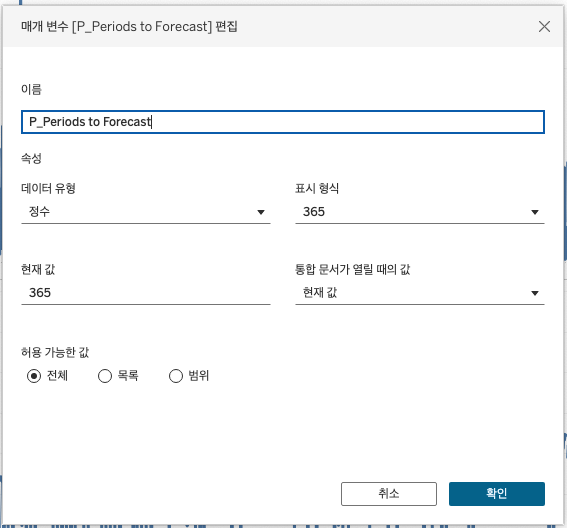

### 4-5. 뷰(View) 구성

- 행: `Date`
- 열: `SUM([매출])`, `C_Time Series Forecasting`

즉, 실제 매출과 Prophet 예측값을 같은 시계열 축에 함께 올려 비교하는 방식입니다.

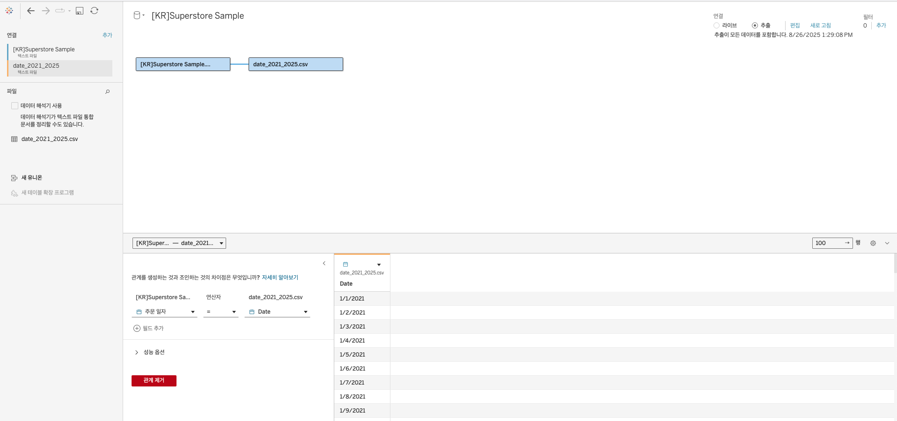
