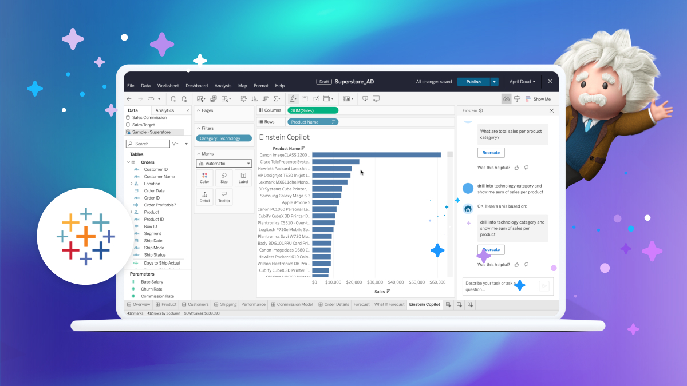

## 학습 목표

- Tableau Agent의 개념과 역할을 이해할 수 있습니다.
- Tableau Agent가 어떤 방식으로 Tableau 데이터 자산을 해석하는지 설명할 수 있습니다.
- Tableau Agent의 활용 범위와 비용 특성을 이해할 수 있습니다.

## 목차

1. 태블로 에이전트 (Tableau Agent)이란?
2. Tableau Agent의 핵심 기능
3. Tableau Agent 동작 원리
4. 데모 영상

## 1. 태블로 에이전트 (Tableau Agent)이란? 2024년 4월 공개



Tableau Agent는 자연어로 Tableau의 데이터, 지표, 대시보드를 이해·설명·분석하도록 돕는 AI 어시스턴트입니다.

- Tableau에 이미 있는 `데이터 자산`
- `계산식`
- `KPI`
- `메타데이터`

를 이해하고, 질문에 맞게 요약·해석·가이드를 제공합니다.

즉, Tableau Agent는 단순히 문장을 생성하는 기능이 아니라, `Tableau 안에 쌓여 있는 분석 자산을 바탕으로 답변하는 AI 인터페이스`라고 이해하시면 됩니다.

## 2. Tableau Agent의 핵심 기능

예를 들어 사용자는 다음과 같은 질문을 할 수 있습니다.

- “이번 달 매출 왜 떨어졌어?”
- “전월 대비 가장 많이 감소한 지역은?”
- “이 KPI 지금 정상 상태야?”

이런 질문들에 대해 Tableau Agent는 내부적으로 `VizQL Data Service`, `Metadata`, `Pulse Metric` 등을 호출해서 실제 데이터 기반으로 답변합니다.

즉, 미리 정의된 대시보드만 보여주는 것이 아니라, 자연어 질문을 기반으로 기존 데이터 자산을 탐색하고 설명하는 역할을 합니다.

## 3. Tableau Agent 동작 원리

동작 흐름은 다음과 같이 이해할 수 있습니다.

```text
사용자 질문
   ↓
Copilot (LLM)
   ↓
MCP Tool 선택
   ↓
Tableau API / VDS / Metadata / Pulse
   ↓
결과 요약 및 설명
```

핵심은 Tableau Agent가 단독으로 모든 답을 만들어내는 것이 아니라, `Tableau 내부 서비스와 메타데이터를 호출한 뒤 그 결과를 자연어로 정리해 주는 구조`라는 점입니다.

그래서 실무적으로는 다음이 중요합니다.

- 지표 정의가 명확해야 합니다.
- 메타데이터가 정리되어 있어야 합니다.
- Pulse Metric, 계산식, 데이터 자산 품질이 좋아야 더 좋은 답변이 나옵니다.

즉, Agent 성능은 모델 자체만이 아니라 `조직 안의 Tableau 자산 품질`에 크게 좌우됩니다.

## 4. 데모 영상

[Tableau Agent Demo](https://www.youtube.com/watch?v=2Fe8dGsdifM)

❗ Tableau AI 에이전트 비용은 별도 요금으로 책정되며, 주로 `Tableau Cloud`의 프리미엄 티어인 `Tableau+`에 포함되어 제공되거나 영업팀 협의를 통해 책정됩니다.
