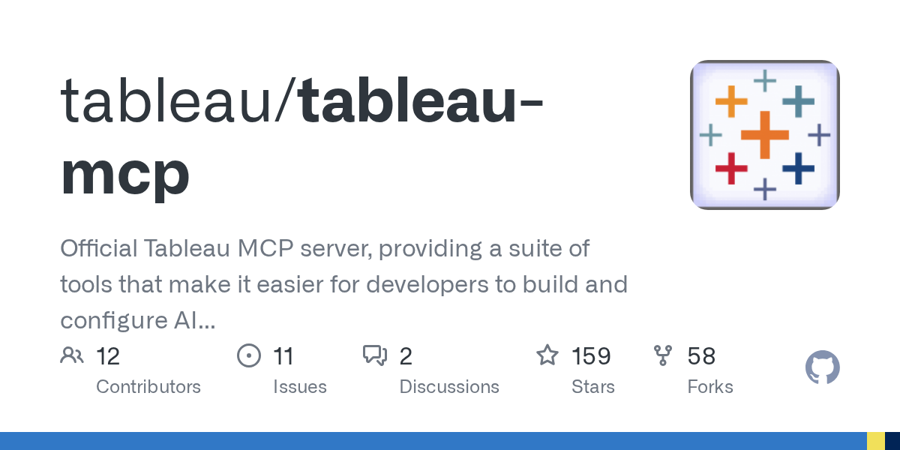

## 학습 목표

- Tableau MCP의 개념과 역할을 이해할 수 있습니다.
- Tableau MCP가 LLM과 Tableau Cloud 사이에서 어떤 역할을 하는지 설명할 수 있습니다.
- Tableau MCP 연결에 필요한 기본 구성 요소를 이해할 수 있습니다.

## 목차

1. Tableau MCP란?
2. Tableau MCP 아키텍처 구조
3. Tableau MCP가 실제로 하는 일
4. MCP 연결 설정

## 1. Tableau MCP란? 2025년 11월 공개

[GitHub - tableau/tableau-mcp](https://github.com/tableau/tableau-mcp)



Tableau MCP(Model Context Protocol)는 LLM(Claude 등)이 Tableau Cloud에 있는 데이터, 대시보드, 이미지를 API를 통해 안전하게 조회·분석하도록 중간에서 연결해 주는 Bridge 레이어입니다.

즉, AI가 Tableau에 직접 접속하는 것이 아니라, `MCP 서버를 통해 허용된 기능만 호출`하고 그 결과를 다시 AI가 해석·요약하는 구조입니다.

핵심은 다음과 같습니다.

- Tableau 자산을 AI가 직접 임의 접근하지 않음
- MCP 서버가 허용된 범위의 기능만 노출
- AI는 그 결과를 받아 요약과 설명을 수행

즉, Tableau MCP는 단순한 API 래퍼가 아니라 `AI와 Tableau 사이의 안전한 실행 통로`라고 이해하시면 됩니다.

## 2. Tableau MCP 아키텍처 구조

구조는 다음과 같이 이해할 수 있습니다.

```text
사용자 질문
  ↓
Claude Desktop (LLM)
  ↓
Tableau MCP (Bridge)
  ↓
Tableau Cloud
```

이 구조에서 중요한 점은 역할 분리입니다.

- 사용자는 자연어로 질문합니다.
- LLM은 질문을 해석합니다.
- Tableau MCP는 실제로 허용된 도구 호출을 담당합니다.
- Tableau Cloud는 데이터와 대시보드 자산을 제공합니다.

즉, LLM은 해석과 요약을 담당하고, 실제 데이터 접근은 MCP가 통제하는 구조입니다.

## 3. Tableau MCP가 실제로 하는 일

### 3-1. 데이터 조회

Tableau Cloud에 있는 데이터 자산을 조회할 수 있습니다.

예를 들어:

- 특정 지표 값 조회
- 게시된 데이터 원본 기반 정보 확인
- 대시보드 뒤에 있는 데이터 결과 확인

### 3-2. 대시보드 이미지 조회

게시된 대시보드나 뷰의 이미지를 가져와서 AI가 화면을 바탕으로 설명하도록 도울 수 있습니다.

즉, 숫자 데이터뿐 아니라 `시각화 결과 자체`를 함께 해석하는 흐름이 가능합니다.

### 3-3. 결과 전달

MCP가 데이터를 직접 해석해서 최종 답을 만드는 것이 아니라, 조회 결과를 LLM 쪽에 전달하면 LLM이 그 결과를 요약하고 설명합니다.

즉:

- Tableau MCP: 조회와 연결
- LLM: 해석과 설명

으로 역할이 나뉩니다.

## 4. MCP 연결 설정

기본적으로 다음 준비가 필요합니다.

- Tableau Cloud 계정
- PAT 발급
- Node.js
- Claude Desktop
- MCP 서버 실행

설정 예시는 다음과 같습니다.

```json
{
  "mcpServers": {
    "tableau": {
      "command": "npx",
      "args": ["-y", "@tableau/mcp-server@latest"],
      "env": {
        "SERVER": "https://your-tableau-server.com",
        "SITE_NAME": "your_site",
        "PAT_NAME": "mcp_demo",
        "PAT_VALUE": "********"
      }
    }
  }
}
```

실무적으로는 여기서 `PAT_VALUE`, 서버 주소, 사이트 이름 같은 인증 정보 관리가 가장 중요합니다.  
즉, Tableau MCP는 연결만 되면 끝나는 기능이 아니라, `권한과 인증을 안전하게 관리하면서 AI와 Tableau를 연결하는 운영 설정`까지 포함하는 개념입니다.
