## 학습 목표

- 유니온, 조인, 정리, 출력 단계를 활용해 전처리 흐름을 설계할 수 있습니다.
- 필드 불일치, 조인 누락, 불필요 필드 제거 같은 실무형 전처리 이슈를 해결할 수 있습니다.

## 목차

1. 유니온
2. 조인
3. 출력

## 1. 유니온

### 2021년과 2022년 유니온

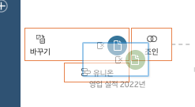

`영업 실적 2022년` 파일을 드래그해 `영업 실적 2021년` 위에 올리면 유니온과 조인 중 하나를 선택할 수 있습니다.
이때 유니온 위에 드롭하면 두 파일이 세로 방향으로 결합됩니다.

### 유니온 추가

이 상태에서 `영업 실적 2023년`을 같은 방식으로 `유니온 1`에 추가합니다.

이제 `영업 실적 2024년`도 같은 방식으로 추가하면 4개년 데이터가 하나의 유니온 흐름으로 정리됩니다.

이렇게 하면 연도별로 분리된 4개 파일을 하나의 테이블처럼 다룰 수 있습니다.
다음 단계에서는 유니온 결과에서 불일치한 컬럼을 정리합니다.

### 불일치 컬럼 정리

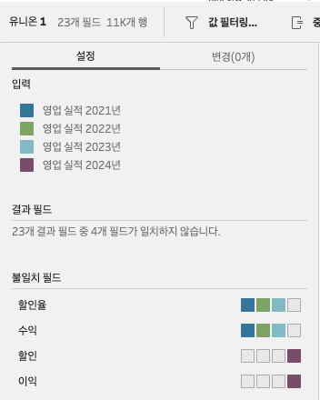

유니온 결과를 보면 특정 연도 파일의 필드명이 다른 경우 불일치 경고가 나타날 수 있습니다.

예를 들어:

- 다른 파일은 `할인율`, `수익`
- 2024년 파일은 `할인`, `이익`

처럼 이름이 다르면 같은 의미의 컬럼이어도 별도 필드로 인식됩니다.

### 불일치 필드 병합

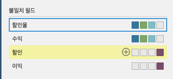

`할인율`과 `할인`을 하나로 합치고,

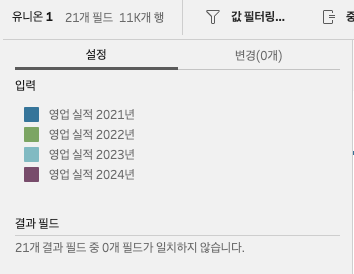

`수익`과 `이익`도 같은 방식으로 합칩니다.

실무에서 이 단계는 매우 중요합니다.  
컬럼 이름 불일치를 그대로 두면 이후 Desktop에서 같은 의미의 값이 서로 다른 필드로 나뉘어 집계 오류가 생기기 때문입니다.

## 2. 조인

### 지역별 관리자 조인

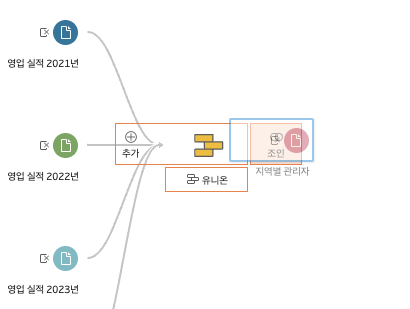

`지역별 관리자` 파일을 `유니온 1` 위에 드래그해 조인합니다.

처음에는 일부 값이 조인되지 않을 수 있습니다.  
예를 들어 `서울경기`와 `수도권`처럼 사실상 같은 의미인데 표기가 달라서 생기는 문제입니다.

### 조인 키 값 보정

값을 `수도권`으로 통일하면 조인 누락이 해소됩니다.

이 단계는 실무에서 매우 자주 발생합니다.

- 동의어 사용
- 띄어쓰기 차이
- 대소문자 차이
- 코드 체계 변경

때문에 조인 누락이 생기기 때문입니다.

즉, 조인이 안 된다고 해서 바로 조인 조건부터 의심하기보다, 먼저 키 값 표준화 여부를 확인하는 습관이 중요합니다.

### 반품 현황 조인

`반품 현황`을 다시 조인하면 기본 조인 유형은 내부 조인으로 잡히는 경우가 많습니다.

이 경우 반품된 주문만 남게 되므로, 전체 주문 데이터에 반품 여부를 붙이고 싶은 목적과 맞지 않습니다.

### 조인 유형 변경

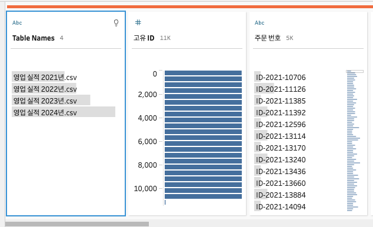

따라서 조인 유형을 왼쪽 조인으로 바꿔야 합니다.

즉:

- 전체 주문 데이터는 유지하고
- 반품된 주문에만 반품 정보가 붙는 구조

를 만들어야 합니다.

실무에서 이 부분은 가장 흔한 조인 실수 중 하나입니다.  
조인 자체는 성공했지만, 조인 유형을 잘못 선택해 데이터가 의도치 않게 줄어드는 경우가 많기 때문입니다.

### 필드 제거

조인까지 끝나면 정리 단계를 추가해 최종 데이터셋을 다듬습니다.

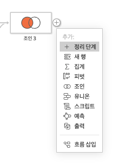

유니온 과정에서 자동 생성된 `Table Names` 같은 필드는 분석에 필요 없으면 제거합니다.

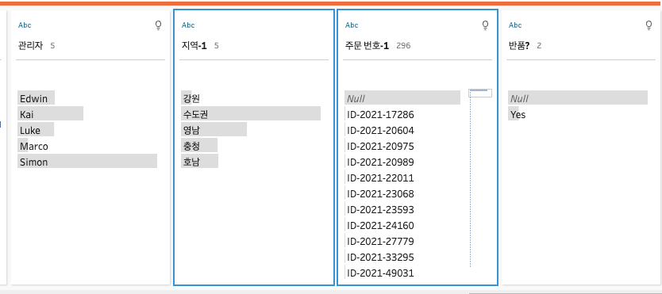

마찬가지로 조인 과정에서 생성된 `지역-1`, `주문 번호-1` 같은 보조 필드도 제거합니다.

실무적으로는 이 정리 단계가 꽤 중요합니다.

- 최종 데이터셋 구조를 단순하게 만들고
- Desktop에서 필드 탐색을 쉽게 하며
- 사용자가 헷갈릴 수 있는 중복 필드를 제거하기 때문입니다

즉, 전처리는 데이터를 붙이는 작업에서 끝나는 것이 아니라, "최종 사용자가 보기 좋은 스키마로 정리하는 단계"까지 포함합니다.

## 3. 출력

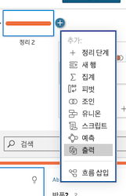

정리가 끝나면 출력(Output) 단계를 추가합니다.

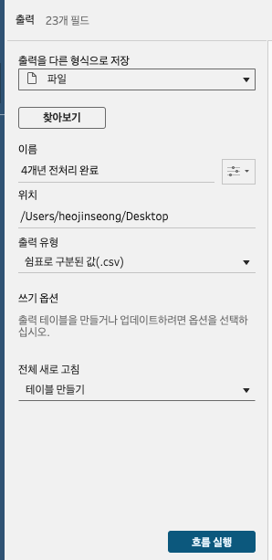

출력 단계에서는:

- 파일
- 데이터베이스
- 기타 대상

등의 형식을 선택할 수 있습니다.

파일로 출력할 경우, 어떤 형식으로 저장할지도 고를 수 있습니다.

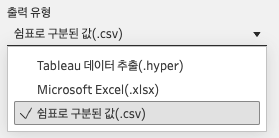

특히 `.hyper` 파일은 Tableau의 데이터 추출 전용 포맷으로, Desktop에서 빠르게 연결하고 활용하기 좋습니다.

이름과 경로를 지정한 뒤 흐름 실행을 누르면, 지정한 위치에 전처리 결과가 저장됩니다.
