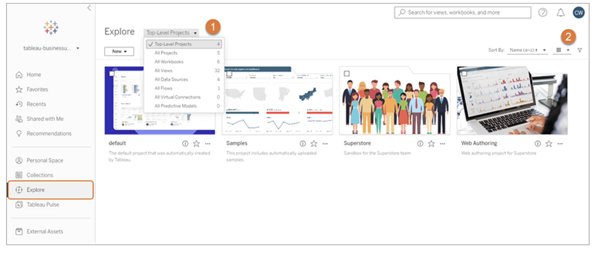

## 학습 목표

- Tableau Cloud의 주요 화면 구조를 이해할 수 있습니다.
- 프로젝트, 통합 문서, 뷰, 데이터 원본의 차이를 구분할 수 있습니다.
- Tableau Cloud UI가 운영 단위와 권한 단위라는 점을 이해할 수 있습니다.

## 목차

1. 홈 화면
2. 탐색 화면과 콘텐츠 단위

## 1. 홈 화면

Tableau Cloud를 제대로 쓰려면, 먼저 콘텐츠가 어떻게 구성되는지 이해해야 합니다.  
그래야 사용자가 어디에서 무엇을 찾고, 어떤 단위로 공유하고 관리하는지 감이 잡힙니다.

Cloud 홈 화면에서는 보통 다음 영역을 보게 됩니다.

- 내비게이션 패널
- 즐겨찾기
- 최근 조회
- 추천 콘텐츠

이 구조는 단순히 보기 좋은 홈 화면이 아니라, 사용자가 자주 쓰는 콘텐츠에 빠르게 접근하게 해 주는 탐색 허브입니다.

즉, 실무적으로는 홈 화면이 `분석 시작점` 역할을 합니다.

## 2. 탐색 화면과 콘텐츠 단위

Tableau Cloud에서 자주 보는 콘텐츠 단위는 다음과 같습니다.

| 유형 | 설명 |
| --- | --- |
| 프로젝트 (Project) | 사이트 내 콘텐츠를 정리하는 폴더 역할. 하위 프로젝트를 포함할 수 있음 |
| 통합 문서 (Workbook) | 여러 개의 뷰(View)를 담는 상위 패키지 |
| 뷰 (View) | 단일 워크시트, 대시보드, 또는 스토리 |
| 데이터 원본 (Data Source) | 게시된 라이브 또는 추출 데이터 원본 |
| 플로우 (Flow) | Tableau Prep에서 만든 데이터 준비 흐름 |

이 구조를 이해하는 것이 중요한 이유는 권한과 공유 범위가 이 단위들에 따라 달라지기 때문입니다.

예를 들어:

- 프로젝트 권한을 잠그면 하위 콘텐츠 전체에 영향을 줄 수 있고
- 워크북 단위 공유와 뷰 단위 공유는 사용자 경험이 다를 수 있으며
- 데이터 원본 권한은 대시보드 편집 가능 여부에도 영향을 줄 수 있습니다.

즉, Cloud UI는 단순 폴더 구조가 아니라 `운영 단위와 권한 단위의 구조`이기도 합니다.
