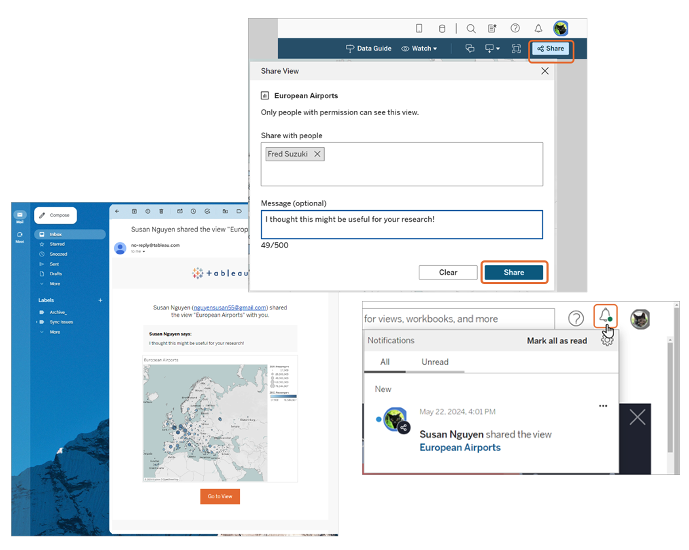
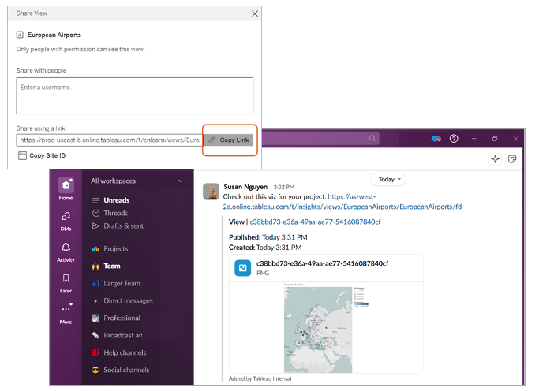
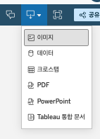
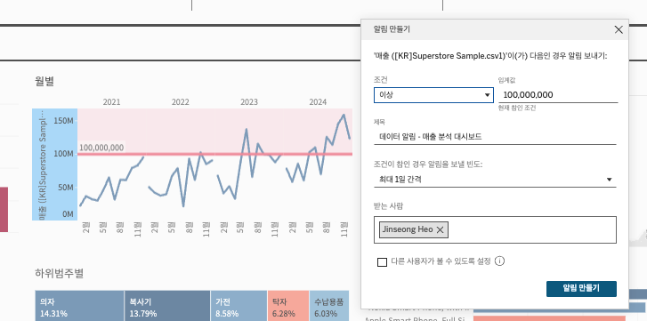

## 학습 목표

- Tableau Cloud에서 대시보드를 공유하는 다양한 방법을 구분할 수 있습니다.
- 직접 공유, 링크 공유, 다운로드, 댓글, 구독, 알림의 차이를 설명할 수 있습니다.
- 실무 상황에 맞는 전달 방식을 선택할 수 있습니다.

## 목차

1. 직접 공유
2. 링크 공유
3. 다운로드
4. 댓글
5. 구독
6. 알림

Tableau Cloud에서는 대시보드를 여러 방식으로 공유할 수 있습니다.  
공유 방식마다 목적이 다르기 때문에, 상황에 맞는 선택이 중요합니다.

## 1. 직접 공유

직접 공유는 특정 사용자나 그룹을 지정해서 권한과 함께 공유하는 방식입니다.

주로 다음 상황에 적합합니다.

- 팀원 몇 명에게만 우선 검토를 요청할 때
- 특정 부서만 볼 수 있게 제한해야 할 때
- 보기/편집/다운로드 권한을 세부적으로 조정해야 할 때

즉, 직접 공유는 `권한 제어가 중요한 협업 공유 방식`입니다.

## 2. 링크 공유

링크 공유는 현재 워크북 또는 뷰의 URL을 복사해서 전달하는 방식입니다.

이 방식은 다음과 같은 경우에 유용합니다.

- 메신저나 이메일로 빠르게 전달할 때
- 회의 자료에 링크를 붙일 때
- 사내 포털이나 문서에 임베드할 때

다만 중요한 점이 있습니다.  
링크를 안다고 해서 누구나 볼 수 있는 것은 아니고, 실제 접근 가능 여부는 `권한 설정`에 따라 결정됩니다.

## 3. 다운로드

Cloud에서는 대시보드를 직접 보는 것 외에도 다양한 형식으로 결과를 내려받을 수 있습니다.

대표적인 활용은 다음과 같습니다.

- PNG: 문서 첨부, 슬라이드 삽입
- PDF: 인쇄 및 배포용
- PowerPoint: 발표 자료용
- CSV / Excel: 데이터 검토 및 추가 분석용
- Crosstab: 표 형태 숫자 전달용

즉, Tableau Cloud는 웹 열람 플랫폼이면서 동시에 `결과물 전달 플랫폼`이기도 합니다.

## 4. 댓글

댓글 기능은 단순 메모가 아니라 `분석 맥락을 남기는 협업 기록`입니다.

특히 다음 상황에서 유용합니다.

- 특정 필터 상태를 기준으로 피드백 남기기
- 특정 뷰에 대한 해석 차이 논의
- 수정 요청, 검토 의견, 확인 코멘트 기록

댓글은 단순 채팅보다 강점이 있습니다.  
왜냐하면 그 의견이 `어떤 대시보드 상태를 보고 남긴 것인지` 맥락이 함께 보존되기 때문입니다.

## 5. 구독

구독(Subscriptions)은 최신 상태의 뷰나 워크북을 정기적으로 이메일로 받아보는 기능입니다.

예를 들어:

- 매주 월요일 오전 9시에 주간 실적 대시보드 수신
- 매일 아침 전일 매출 요약 이미지 수신

같은 시나리오가 가능합니다.

이 기능은 “사용자가 직접 들어와 보지 않아도 최신 상태를 받게 한다”는 점에서 중요합니다.

즉, 구독은 `대시보드를 찾아오게 하는 기능`이 아니라 `대시보드를 사용자에게 보내는 기능`입니다.

## 6. 알림

Data-Driven Alerts는 특정 지표가 임계값을 넘거나 조건을 만족했을 때 알림을 보내는 기능입니다.

예를 들어:

- 매출이 목표치 미만일 때
- 재고 부족 지표가 기준 이하로 내려갔을 때
- 응답률이 특정 수준을 하회할 때

알림을 받을 수 있습니다.

즉, 구독이 정기 전달이라면, 알림은 `이벤트 기반 반응`입니다.
