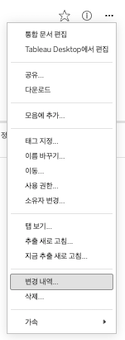
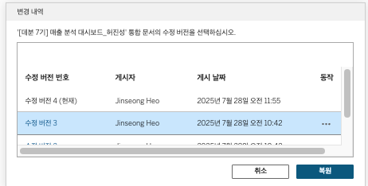

## 학습 목표

- Tableau Cloud와 Tableau Server의 버전 관리 개념을 이해할 수 있습니다.
- 수정 이력 확인과 복원의 목적을 설명할 수 있습니다.
- 협업 환경에서 버전 관리가 왜 중요한지 설명할 수 있습니다.

## 목차

1. 버전 관리란?
2. 왜 중요한가?
3. 실무적으로 기억할 점

## 1. 버전 관리란?

Tableau Cloud 또는 Server에 게시된 통합 문서는 수정될 때마다 새로운 버전이 자동 저장됩니다.

이 기능은 협업에서 매우 중요합니다.  
왜냐하면 실무에서는 언제든 다음 상황이 생기기 때문입니다.

- 누군가 잘못 덮어씀
- 기존 계산이 깨짐
- 대시보드 레이아웃이 수정 중 망가짐
- 원래 상태로 되돌아가야 함

이때 버전 관리 기능이 있으면 특정 시점으로 돌아가거나, 변경 이력을 추적할 수 있습니다.

즉, 버전 관리는 단순 백업이 아니라 `협업 환경에서의 안전장치`입니다.

## 2. 왜 중요한가?

- 누가 언제 수정했는지 추적 가능
- 과거 상태 확인 가능
- 필요 시 특정 버전으로 롤백 가능
- 운영 중 사고 복구에 유용

즉, Cloud에서의 수정은 “현재 상태만 저장되는 것”이 아니라, `이력과 함께 운영되는 변경`으로 이해하는 것이 맞습니다.

## 3. 실무적으로 기억할 점

- 일반적으로 최신 버전이 계속 누적되며 자동 관리됩니다.
- 오래된 버전은 일정 개수 이후 자동 정리될 수 있습니다.
- 수정이 잦은 협업 문서일수록 버전 관리 중요성이 커집니다.
